# ArchiMate AI Studio — deployment architecture

**Parent:** [`overview.md`](overview.md)  
**Last updated:** 2026-09-11

---

## 1. Production topology

```mermaid
flowchart TB
  subgraph users["Users"]
    BROWSER["Browser"]
  end

  subgraph cdn["CDN"]
    VERCEL["Vercel / Cloudflare Pages\nReact SPA"]
  end

  subgraph app["Application tier — Railway"]
    API["archi-api\nASP.NET Core 9"]
    WORKER["Hangfire worker\n(same container or sidecar)"]
  end

  subgraph data["Data tier"]
    NEON["Neon PostgreSQL\n+ pgvector"]
    UPSTASH["Upstash Redis"]
    R2["Cloudflare R2"]
  end

  subgraph ai["AI tier — RunPod"]
    CHAT["Serverless chat"]
    VIS["Serverless vision"]
    EMB["Serverless embed"]
  end

  subgraph auth["Auth"]
    CLERK["Clerk"]
  end

  BROWSER --> VERCEL
  BROWSER --> API
  API --> CLERK
  API --> NEON & UPSTASH & R2
  WORKER --> NEON & UPSTASH & R2
  WORKER --> CHAT & VIS & EMB
  API --> WORKER
```



---

## 2. Environment matrix

| Component | dev | test | prod |
|-----------|-----|------|------|
| API + Worker | Docker Compose locally | Railway preview | Railway prod |
| PostgreSQL | Docker / Neon branch | Neon branch | Neon main |
| Redis | Docker / Upstash dev | Upstash | Upstash prod |
| R2 | MinIO local / dev bucket | test bucket | prod bucket |
| RunPod | Shared dev endpoints | CI mock + optional real | Dedicated endpoints, min workers ≥ 1 |
| Frontend | Vite dev server | Preview deploy | Production CDN |
| Clerk | Dev instance | Test instance | Prod instance |

---

## 3. Container layout (MVP)

Single Railway service:

```dockerfile
# Multi-process via supervisord or dotnet tool
# Process 1: ArchiMateAiStudio.Api (HTTP)
# Process 2: Hangfire server (same assembly, Worker host)
```

Scale path:

- Split Worker to second Railway service when CPU > 70% sustained
- Read replicas on Neon for search-heavy tenants (Phase 3)

---

## 4. RunPod deployment

| Endpoint | GPU | Min workers | Max workers |
|----------|-----|-------------|-------------|
| chat (72B) | A100 80GB or 2×A40 | 0–1 (prod: 1) | 5 |
| vision (7B) | L4 / RTX 4090 | 0 | 3 |
| embed | CPU or T4 | 0 | 2 |

Use RunPod **template** with vLLM OpenAI server for chat/vision; custom handler for embeddings if needed.

---

## 5. Networking & security

| Rule | Implementation |
|------|----------------|
| HTTPS only | Railway + Vercel default TLS |
| API CORS | Allow frontend origin only |
| Secrets | Railway variables; never in repo |
| Tenant isolation | JWT org claim + EF global query filter |
| R2 access | Presigned URLs; 15 min TTL |
| RunPod | Outbound HTTPS from worker only |

---

## 6. Observability

| Signal | Tool |
|--------|------|
| Errors | Sentry (.NET + React) |
| Traces | OpenTelemetry → Grafana Cloud or Railway metrics |
| LLM cost | Custom metrics: tokens × endpoint price |
| Job queue | Hangfire dashboard (auth-protected) |

---

## 7. Backup & DR

| Asset | Strategy |
|-------|----------|
| PostgreSQL | Neon PITR (7–30 days) |
| R2 objects | Versioning enabled on prod bucket |
| `.archimate` exports | Nightly export job per model to R2 |

**RTO target:** 4 hours (MVP). **RPO:** 24 hours for metadata; 0 for last exported model file.

---

## 8. Local development

`docker-compose.yml`:

- postgres:16 + pgvector
- redis:7
- minio (R2 stand-in)
- optional: mock LLM wiremock container

RunPod calls hit real dev endpoints or mock via `LLM_MOCK=true`.

---

## 9. Cost estimate (MVP, low traffic)

| Item | ~Monthly |
|------|----------|
| Railway API+worker | $15–25 |
| Neon | $0–19 |
| Upstash Redis | $0–10 |
| R2 | $0–5 |
| RunPod (variable) | $20–100 by usage |
| Clerk | $0–25 |
| Vercel | $0 |

Fixed ~$35–50 + RunPod inference per active architect team.
