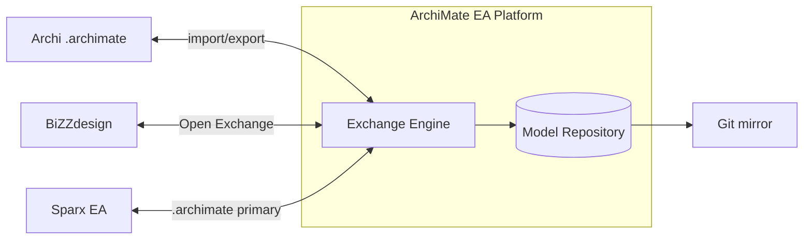
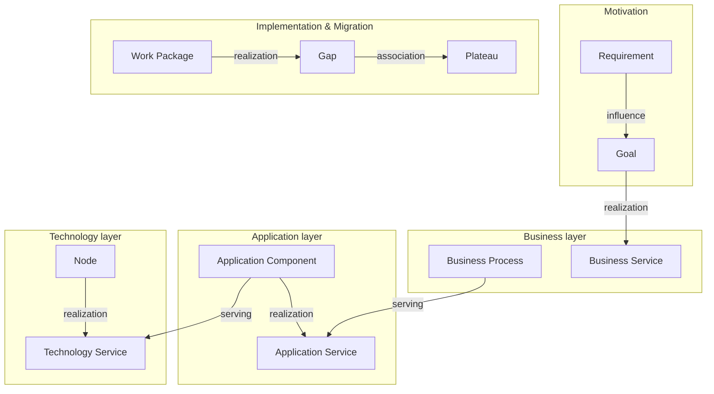
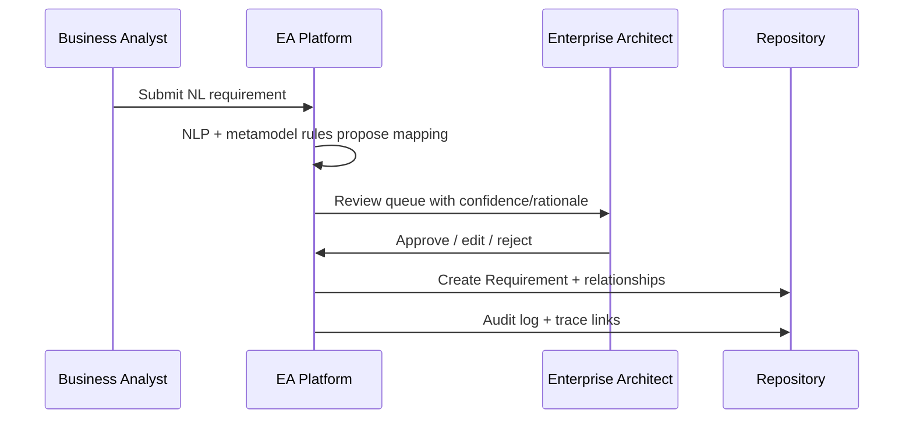
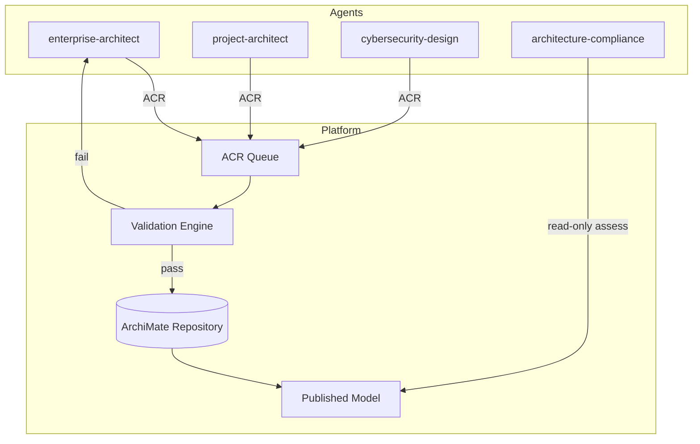

# ArchiMate EA Platform — enterprise requirements

**Document type:** Enterprise architecture requirements (ISO 42010 architecture description input)  
**Version:** 1.0  
**Date:** 2026-09-11  
**ADM phases addressed:** Preliminary, A, B–D (modeling), E–F (migration), G–H (governance), RM (requirements)  
**Primary consumer:** `/project-architect`

---

## 1. Standard mapping

| ID | Standard | Reference | Requirement / artifact | How this work satisfies it |
|----|----------|-----------|------------------------|----------------------------|
| TM-PRE-01 | TOGAF 10 | Preliminary — Principles Catalog | Architecture principles stored as ArchiMate `Principle` with rationale | FR-010, FR-011; motivation layer with trace links |
| TM-A-01 | TOGAF 10 | Phase A — Architecture Vision | Stakeholder map, drivers, goals in motivation layer | FR-020, FR-021; stakeholder views |
| TM-A-02 | TOGAF 10 | Phase A — Stakeholder Map | Stakeholder ↔ concern ↔ viewpoint routing | FR-030, FR-031; ISO viewpoint catalog |
| TM-B-01 | TOGAF 10 | Phase B — Business catalogs | Actor, Role, Process, Service, Object catalogs | FR-100–FR-120; queryable catalogs |
| TM-B-GAP | TOGAF 10 | Phase B–F — Gap analysis | Baseline vs target gaps as ArchiMate `Gap` | FR-200, FR-201 |
| TM-C-APP-01 | TOGAF 10 | Phase C — Application Portfolio | Application Component/Service/Interface inventory | FR-130–FR-140 |
| TM-D-01 | TOGAF 10 | Phase D — Technology Standards | Technology Service, Node, standards tagging | FR-150–FR-160 |
| TM-E-01 | TOGAF 10 | Phase E — Architecture Roadmap | Work Package, Plateau, Deliverable sequencing | FR-210–FR-220 |
| TM-E-02 | TOGAF 10 | Phase E — Benefits Diagram | Outcome, Value linked to Goals | FR-022; benefits metadata on elements |
| TM-F-01 | TOGAF 10 | Phase F — Migration plan | Transition plateaus, gap closure packages | FR-200–FR-220 |
| TM-G-01 | TOGAF 10 | Phase G — Architecture Contract | Implementation events, compliance checkpoints | FR-400–FR-410 |
| TM-RM-01 | TOGAF 10 | Requirements Management | Requirements catalog with impact analysis | FR-050–FR-070, FR-500 |
| SM-CTX-WHY | SABSA | Contextual / Why — business risk | Security drivers, assessments on motivation layer | FR-060; security overlay viewpoint |
| SM-LOG-HOW | SABSA | Logical / How — security services | Security services realized by application/technology | FR-061; cross-layer serving/realization |
| SM-OP-WHO | SABSA | Operational / Who — accountability | Role assignment, audit actor on changes | FR-400, FR-401 |
| AM-BUS-PROC | ArchiMate 3.2 | Business Process + relationships | Full behavior/active/passive structure | DM-020 |
| AM-MOT-REQ | ArchiMate 3.2 | Requirement element | NL → Requirement with influence/serving links | FR-050–FR-055 |
| AM-MIG-PLATEAU | ArchiMate 3.2 | Plateau | Dated interim architecture states | FR-200, DM-050 |
| AM-MIG-GAP | ArchiMate 3.2 | Gap | Documented baseline/target differences | FR-201 |
| AM-MIG-WP | ArchiMate 3.2 | Work Package | Program/project work encoded in repository | FR-210 |
| IM-STK | ISO 42010 | Stakeholders identified | Persona registry drives view access | §3 Personas, FR-030 |
| IM-CON | ISO 42010 | Concerns identified | Concern tags on viewpoints and requirements | FR-031 |
| IM-VP | ISO 42010 | Viewpoint specified | Viewpoint definition store with layer/aspect filters | FR-300–FR-310 |
| IM-VW | ISO 42010 | View produced per viewpoint | View instances with diagram layout | FR-320–FR-340 |
| IM-CORR | ISO 42010 | Correspondences documented | Cross-view consistency rules and reports | FR-350, FR-360 |
| IM-RAT | ISO 42010 | Rationale recorded | ADR/decision links on elements and relationships | FR-011, FR-410 |
| IM-SEC | ISO 42010 | Security concerns framed | Dedicated security viewpoint + SABSA matrix tags | FR-060, FR-061 |
| IX-01 | Open Group | ArchiMate Exchange File Format C19C | Import/export `.archimate` (model, view, diagram schemas) | FR-600–FR-620, NFR-030 |
| IX-02 | Open Group | ArchiMate 3.2 metamodel | Relationship validity matrix enforced | FR-110, FR-700–FR-720 |

---

## 2. Architecture summary

### Current state (assumed baseline)

Organizations model architecture in disconnected tools (Archi, BiZZdesign, Sparx EA, documents, agent-generated markdown). Requirements live in prose; traceability to architecture is manual. View proliferation creates stakeholder confusion. Agent outputs (security, solution design) are not systematically encoded in a governed repository.

### Target state

A **governed ArchiMate 3.2 repository application** that:

1. Holds the **canonical metamodel** (all layers, all standard relationship types, metamodel constraints).
2. Accepts **natural-language requirements** and proposes ArchiMate encodings with human approval.
3. Manages **viewpoints and views** including derived/consolidated views and complexity reduction workflows.
4. **Imports/exports** `.archimate` for tool interoperability and supports agent/API ingestion.
5. Provides **versioning, audit trails, and end-to-end traceability** (Requirement → Goal → Process → Application → Technology → Work Package).
6. Runs **validation and data-quality rules** continuously (editor, import, CI).
7. Orchestrates a **multi-agent consultation workflow** where specialized agents contribute structured architecture deltas.

### Scope boundaries

| In scope | Out of scope (delegate) |
|----------|-------------------------|
| ArchiMate modeling, views, exchange, governance | Production code implementation (`/project-architect`) |
| Security *architecture* encoding (SABSA overlay) | Detailed security control baselines (`/cybersecurity-design`) |
| Compliance *checks* against documented models | Code/test compliance (`/architecture-compliance`) |
| Model validation CI hooks | Pipeline implementation (`/cicd-release`) |

---

## 3. Personas and use cases

### 3.1 Personas

| ID | Persona | Primary concerns (ISO 42010) | Typical viewpoints |
|----|---------|------------------------------|-------------------|
| P-01 | **Enterprise Architect** | Integration, standards, duplication, migration | Motivation, layered, migration |
| P-02 | **Business Analyst** | Process clarity, requirement completeness | Business process cooperation |
| P-03 | **Solution / Project Architect** | Implementability, module boundaries, dependencies | Application cooperation, infrastructure |
| P-04 | **Security Architect** | Risk, control traceability, assurance | Security (SABSA overlay), motivation |
| P-05 | **Program Manager** | Roadmap, dependencies, feasibility | Migration, implementation & migration |
| P-06 | **CISO / Compliance Officer** | Auditability, policy adherence | Motivation + security overlay |
| P-07 | **Repository Administrator** | Access control, backup, exchange fidelity | Admin (non-ArchiMate meta) |
| P-08 | **Developer / Integrator** | API clarity, export for downstream tools | Application, technology |
| P-09 | **Executive Sponsor** | Value, outcomes, investment | Motivation, strategy layer summary |

### 3.2 Use cases

| UC-ID | Use case | Actor | ArchiMate / ADM touchpoints |
|-------|----------|-------|----------------------------|
| UC-01 | Capture business requirement in natural language | P-02 | Creates `Requirement`; links via `Influence`/`Realization` |
| UC-02 | Approve/reject proposed ArchiMate mapping | P-01, P-02 | Workflow state on requirement artifact |
| UC-03 | Model baseline business architecture | P-01, P-02 | Business layer catalogs (TM-B-01) |
| UC-04 | Define target architecture and gaps | P-01 | `Gap`, `Plateau`, gap analysis (TM-B-GAP) |
| UC-05 | Plan migration roadmap | P-05 | `Work Package`, `Deliverable`, `Implementation Event` |
| UC-06 | Create stakeholder-specific view | P-01 | Viewpoint filter → view (IM-VP, IM-VW) |
| UC-07 | Consolidate complex views into simpler derived view | P-01 | Derived view rules (FR-330) |
| UC-08 | Import model from Archi / BiZZdesign | P-07, P-01 | `.archimate` import (IX-01) |
| UC-09 | Export model for external EA tool | P-07, P-08 | `.archimate` export with view/diagram fidelity |
| UC-10 | Submit security requirements from agent | P-04 (via agent) | `Requirement`, `Constraint`, SABSA tags |
| UC-11 | Submit solution architecture from project agent | P-03 (via agent) | Application/technology elements + ADRs |
| UC-12 | Run compliance assessment on model | P-06 | Trace completeness, policy rules |
| UC-13 | Validate model on commit | P-07, CI | Metamodel + org rules (FR-700) |
| UC-14 | Browse trace chain requirement → implementation | P-01, P-05 | Graph traversal, correspondences |
| UC-15 | Record architecture decision | P-01, P-03 | Rationale link to elements (IM-RAT) |
| UC-16 | Version/compare architecture states | P-01 | Plateau versioning, diff views |
| UC-17 | Resolve validation violations | P-01, P-03 | Data quality dashboard |

---

## 4. Functional requirements

### 4.1 Repository and metamodel (FR-001–FR-019)

| ID | Requirement | Priority |
|----|-------------|----------|
| FR-001 | The system SHALL maintain a **single logical repository** per enterprise (or tenant) containing one or more **ArchiMate models**. | Must |
| FR-002 | The system SHALL support **all ArchiMate 3.2 core element types** across layers: Strategy, Business, Application, Technology, Physical, Motivation, Implementation & Migration. | Must |
| FR-003 | The system SHALL support **all standard ArchiMate 3.2 relationship types**: Composition, Aggregation, Assignment, Realization, Serving, Access, Influence, Association, Specialization, Flow, Triggering. | Must |
| FR-004 | The system SHALL enforce **metamodel constraints**: valid source/target types per relationship; optional cardinality rules (e.g. Assignment typically structure→behavior). | Must |
| FR-005 | The system SHALL support **element properties**: identifier (UUID), name, documentation, custom properties (string, number, boolean, enum). | Must |
| FR-006 | The system SHALL support **model organization**: folders, optional `Organization` grouping compatible with exchange format. | Must |
| FR-007 | The system SHALL allow **specialization hierarchies** via `Specialization` relationship with cycle detection. | Must |
| FR-008 | The system SHALL support **duplicate detection** (same name + type + scope) with configurable strictness. | Should |
| FR-009 | The system SHALL support **soft delete** with restore and hard purge (admin only). | Should |
| FR-010 | The system SHALL model **Principles** with statement, implication, and rationale fields aligned to TOGAF Principles Catalog. | Must |
| FR-011 | The system SHALL link **Principles** to `Requirement`, `Goal`, and `Constraint` via `Influence` or documented association. | Must |

### 4.2 Motivation, strategy, and requirements (FR-020–FR-079)

| ID | Requirement | Priority |
|----|-------------|----------|
| FR-020 | The system SHALL maintain catalogs of **Stakeholder**, **Driver**, **Assessment**, **Goal**, **Outcome**, **Value**, **Meaning**. | Must |
| FR-021 | The system SHALL visualize **motivation chains**: Driver → Assessment → Goal → Outcome → Value. | Must |
| FR-022 | The system SHALL attach **benefit metadata** (business/security/technology dimension) to Outcome/Value elements per framework-crosswalk benefits evaluation. | Should |
| FR-030 | The system SHALL register **stakeholders** with concerns list and link to viewpoints they consume. | Must |
| FR-031 | The system SHALL tag **concerns** (ISO 42010 set) on viewpoints and requirements. | Must |
| FR-050 | The system SHALL accept **natural-language requirements** (title, description, source, priority, status). | Must |
| FR-051 | The system SHALL **propose ArchiMate encodings** for NL requirements: primary `Requirement` element plus suggested relationships to existing Goal, Process, Application, or Constraint. | Must |
| FR-052 | Proposals SHALL include **confidence score** and **rationale** explaining mapping decisions. | Must |
| FR-053 | Users SHALL **approve, edit, or reject** proposals; rejected proposals retain audit history. | Must |
| FR-054 | Approved requirements SHALL auto-create or link ArchiMate `Requirement` with `Influence`/`Realization`/`Serving` as appropriate. | Must |
| FR-055 | The system SHALL detect **conflicts** between new requirements and existing Constraints/Principles. | Should |
| FR-056 | The system SHALL support **requirement decomposition** (parent/child) via Composition or tracked hierarchy metadata. | Should |
| FR-060 | The system SHALL support **SABSA overlay tags** on elements (layer × question cell ID, e.g. `SM-Logical-How`). | Must |
| FR-061 | The system SHALL provide a **security viewpoint** filtering motivation + logical security services across layers. | Must |
| FR-070 | The system SHALL support **Requirements Management**: status lifecycle (draft, approved, implemented, retired), version, change history. | Must |

### 4.3 Layer modeling — business through technology (FR-100–FR-199)

| ID | Requirement | Priority |
|----|-------------|----------|
| FR-100 | The system SHALL provide **Business layer** editing for Actor, Role, Process, Function, Interaction, Event, Service, Object, Contract, Product, Representation. | Must |
| FR-101 | The system SHALL provide **Strategy layer** editing for Resource, Capability, Value Stream, Course of Action. | Must |
| FR-102 | The system SHALL provide **Application layer** editing for Component, Collaboration, Interface, Function, Interaction, Process, Event, Service, Data Object. | Must |
| FR-103 | The system SHALL provide **Technology layer** editing for Node, Device, System Software, Technology Collaboration, Technology Interface, Path, Communication Network, Technology Function, Process, Interaction, Event, Service, Artifact. | Must |
| FR-104 | The system SHALL provide **Physical layer** editing for Equipment, Facility, Distribution Network, Material. | Must |
| FR-110 | The system SHALL **prevent invalid relationships** at creation time with actionable error messages citing metamodel rule. | Must |
| FR-111 | The system SHALL support **relationship direction** and optional **access type** (read, write, read/write) on Access relationships. | Must |
| FR-120 | The system SHALL generate **TOGAF-aligned catalogs** (query/export): Organization/Actor, Process, Application Portfolio, Technology Portfolio. | Must |
| FR-130 | The system SHALL support **matrices**: e.g. Application/Function, Process/Application Realization (exportable CSV). | Should |
| FR-140 | The system SHALL support **cross-layer patterns** wizard: Business Process ← Application Service ← Application Component ← Technology Service. | Should |
| FR-150 | The system SHALL allow **technology standards** tagging on Technology Service/Node (TM-D-01). | Should |
| FR-160 | The system SHALL support **location** modeling via Grouping, Location (where applicable), or tagged properties. | Should |

### 4.4 Migration and implementation (FR-200–FR-249)

| ID | Requirement | Priority |
|----|-------------|----------|
| FR-200 | The system SHALL model **Plateau** elements with label, date/version, and membership of architecture elements (baseline/target/interim). | Must |
| FR-201 | The system SHALL model **Gap** between plateaus with linked affected elements and remediation notes. | Must |
| FR-210 | The system SHALL model **Work Package**, **Deliverable**, **Implementation Event** with assignment to plateaus and gaps. | Must |
| FR-220 | The system SHALL render **migration roadmap** views (timeline or plateau ladder) from Implementation & Migration elements. | Must |
| FR-230 | The system SHALL support **gap analysis reports**: baseline vs target by layer with counts and unlinked elements. | Must |

### 4.5 Governance, versioning, audit (FR-400–FR-499)

| ID | Requirement | Priority |
|----|-------------|----------|
| FR-400 | The system SHALL maintain **immutable audit log**: who, what, when, before/after snapshot for element, relationship, view changes. | Must |
| FR-401 | Audit entries SHALL record **agent attribution** when change originated from an agent (agent ID, session, prompt hash optional). | Must |
| FR-410 | The system SHALL link **architecture decisions (ADRs)** to affected ArchiMate elements and record rationale (IM-RAT). | Must |
| FR-420 | The system SHALL support **model versioning**: named releases (e.g. "Baseline 2026-Q3", "Target 2027") mapped to plateaus or tags. | Must |
| FR-430 | The system SHALL provide **diff** between versions: added/removed/changed elements, relationships, views. | Must |
| FR-440 | The system SHALL enforce **role-based access control** (read, contribute, approve, admin) per model, folder, or viewpoint. | Must |
| FR-450 | The system SHALL support **approval workflow** for promotion of architecture changes to "published" state. | Should |
| FR-460 | The system SHALL retain **traceability** from Requirement through to Work Package/Deliverable (forward and backward traversal). | Must |

### 4.6 View and viewpoint management (FR-300–FR-399)

| ID | Requirement | Priority |
|----|-------------|----------|
| FR-300 | The system SHALL store **viewpoint definitions** per ISO 42010 template: stakeholders, concerns, layer/aspect filter, allowed elements/relationships, notation. | Must |
| FR-301 | The system SHALL ship **standard ArchiMate viewpoints** (e.g. Organization, Application Structure, Infrastructure, Motivation, Migration) preconfigured. | Must |
| FR-302 | Users SHALL create **custom viewpoints** with filter rules (layer, type, property, tag). | Must |
| FR-310 | Viewpoint definitions SHALL be **versioned** independently of model content. | Should |
| FR-320 | The system SHALL create **views**: named instances of a viewpoint containing a element/relationship subset. | Must |
| FR-321 | Views SHALL support **manual layout** (diagram coordinates) and **automatic layout** (hierarchical, force-directed). | Must |
| FR-330 | The system SHALL support **derived views** defined by rules: e.g. "collapse application components to business services", "hide technology detail", "merge duplicate actors". | Must |
| FR-331 | Derived view rules SHALL be **declarative** (filter + transform + layout preset) and reproducible. | Must |
| FR-332 | The system SHALL support **view consolidation workflow**: analyze source view complexity metrics → suggest simplification → produce derived view with correspondence link to source. | Must |
| FR-340 | The system SHALL maintain **diagram exchange** data compatible with Open Group diagram schema (nodes, connections, bounds, style where supported). | Must |
| FR-350 | The system SHALL document **correspondences** between views (e.g. "View A element X maps to View B element Y") per ISO 42010. | Must |
| FR-360 | The system SHALL report **cross-view inconsistencies** (element in view A not mapped in derived view B; conflicting relationships). | Must |
| FR-370 | The system SHALL filter **stakeholder dashboards** by registered concerns and authorized viewpoints. | Should |

### 4.7 Multi-agent consultation workflow (FR-500–FR-599)

| ID | Requirement | Priority |
|----|-------------|----------|
| FR-500 | The system SHALL expose an **Architecture Change Request (ACR)** API/message schema for agents to submit structured deltas. | Must |
| FR-501 | ACR payload SHALL include: source agent role, ADM phase, standard mapping IDs (TM-/SM-/AM-/IM-), proposed elements/relationships, rationale, affected viewpoints. | Must |
| FR-502 | The system SHALL **validate** agent submissions against metamodel before queuing for review. | Must |
| FR-503 | The system SHALL route ACRs to **review queues** by domain: business (enterprise-architect), product (project-architect), security (cybersecurity-design). | Must |
| FR-504 | Human or delegated approver SHALL **merge, amend, or reject** ACRs with audit trail. | Must |
| FR-510 | The system SHALL support **idempotent agent submissions** (correlation ID) to prevent duplicate elements on retry. | Must |
| FR-520 | The system SHALL notify agents of **acceptance/rejection** with validation errors for remediation. | Should |
| FR-530 | The system SHALL allow agents to **read** published model subsets via API (filter by layer, tag, plateau, viewpoint). | Must |
| FR-540 | The system SHALL store **agent session metadata** linking chat/transcript IDs to ACRs for traceability (not full transcript in model). | Should |
| FR-550 | **`/architecture-compliance`** agent SHALL consume read-only model + ruleset and return compliance report without mutating model. | Must |

### 4.8 Interoperability and exchange (FR-600–FR-699)

| ID | Requirement | Priority |
|----|-------------|----------|
| FR-600 | The system SHALL **import** `.archimate` files conforming to Open Group Model Exchange schema (3.1/3.2). | Must |
| FR-601 | The system SHALL **export** `.archimate` with model, view, and diagram sections. | Must |
| FR-602 | Import SHALL support **merge strategies**: replace model, merge by identifier, merge by name+type with conflict report. | Must |
| FR-603 | Export SHALL preserve **identifiers** (UUID) stable across round-trip when originating from this system. | Must |
| FR-610 | The system SHALL map **property definitions** and custom properties to/from exchange format. | Must |
| FR-620 | The system SHALL log **exchange fidelity report**: elements/relationships/views imported, skipped, warnings (unsupported styling, vendor extensions). | Must |
| FR-630 | The system SHOULD support **BiZZdesign** and **Sparx EA** via `.archimate` exchange as primary path; document known limitations per tool. | Should |
| FR-640 | The system SHOULD support **read-only Git mirror** of exported `.archimate` or canonical JSON for external diff/review. | Should |
| FR-650 | The system MAY support **XMI** export/import as secondary format (lower priority; map to ArchiMate metamodel subset). | Could |

### 4.9 Data quality and validation (FR-700–FR-799)

| ID | Requirement | Priority |
|----|-------------|----------|
| FR-700 | The system SHALL run **continuous validation** in editor: metamodel, mandatory fields, orphan detection. | Must |
| FR-701 | The system SHALL enforce **completeness rules** configurable per plateau/state: e.g. every Business Service must be realized by ≥1 Application Service in target plateau. | Must |
| FR-702 | The system SHALL enforce **consistency rules**: no circular Serving chains; Assignment targets must be behavior elements. | Must |
| FR-703 | The system SHALL detect **dangling relationships** (missing endpoint) and **orphan elements** (no relationships, excluding explicitly tagged leaf nodes). | Must |
| FR-710 | The system SHALL provide **quality score** per model/plateau: completeness %, consistency violations, trace coverage %. | Must |
| FR-720 | The system SHALL support **custom validation rules** (declarative DSL or scripted) for org-specific policies. | Should |
| FR-730 | Validation results SHALL be exportable for **`/architecture-compliance`** and CI gates. | Must |
| FR-740 | Import and ACR merge SHALL run **full validation** before commit. | Must |

### 4.10 Search, analytics, reporting (FR-800–FR-849)

| ID | Requirement | Priority |
|----|-------------|----------|
| FR-800 | The system SHALL provide **full-text search** across names, documentation, properties, ADR links. | Must |
| FR-810 | The system SHALL provide **graph queries**: upstream/downstream impact, requirement trace paths, shortest path between elements. | Must |
| FR-820 | The system SHALL generate **standard reports**: catalog listings, gap summaries, traceability matrix (Requirement × Work Package). | Must |
| FR-830 | The system SHALL support **metrics dashboard**: element counts by layer, relationship density, open violations, unpublished ACRs. | Should |

---

## 5. Non-functional requirements

### 5.1 Performance and scale (NFR-001–NFR-019)

| ID | Requirement | Target |
|----|-------------|--------|
| NFR-001 | Interactive diagram render (≤500 elements in view) | ≤ 2 s initial render |
| NFR-002 | Full model validation (≤10,000 elements) | ≤ 60 s batch |
| NFR-003 | Import `.archimate` (≤50 MB) | ≤ 120 s with report |
| NFR-004 | Search query response | ≤ 1 s p95 |
| NFR-005 | Concurrent editors per model | ≥ 20 (with merge/conflict handling) |
| NFR-006 | Repository scale | ≥ 100,000 elements per tenant without architectural redesign |

### 5.2 Availability and reliability (NFR-020–NFR-029)

| ID | Requirement | Target |
|----|-------------|--------|
| NFR-020 | Service availability (hosted deployment) | 99.5% monthly |
| NFR-021 | RPO / RTO | RPO ≤ 1 h; RTO ≤ 4 h |
| NFR-022 | Automated backup of model store | Daily minimum |
| NFR-023 | Graceful degradation if layout engine unavailable | Table/graph view fallback |

### 5.3 Interoperability and standards (NFR-030–NFR-039)

| ID | Requirement | Target |
|----|-------------|--------|
| NFR-030 | Exchange format conformance | Pass Open Group XSD validation on export |
| NFR-031 | ArchiMate version declaration | 3.2 in export metadata |
| NFR-032 | API format | OpenAPI-documented REST or GraphQL with JSON payloads |
| NFR-033 | Agent integration | Versioned ACR JSON schema with backward compatibility |

### 5.4 Security (NFR-040–NFR-059)

| ID | Requirement | Target |
|----|-------------|--------|
| NFR-040 | Authentication | SSO (OIDC/SAML) for enterprise; local auth for standalone |
| NFR-041 | Authorization | RBAC + optional ABAC on folders/viewpoints |
| NFR-042 | Audit log integrity | Append-only; tamper-evident (hash chain or WORM storage) |
| NFR-043 | Encryption in transit | TLS 1.2+ |
| NFR-044 | Encryption at rest | AES-256 or platform equivalent |
| NFR-045 | Agent API authentication | Scoped tokens; least privilege per agent role |
| NFR-046 | Sensitive metadata | Classification tags; restrict export by classification |

### 5.5 Usability and accessibility (NFR-060–NFR-069)

| ID | Requirement | Target |
|----|-------------|--------|
| NFR-060 | ArchiMate notation | Standard shapes/colors per layer (configurable theme) |
| NFR-061 | Keyboard navigation for diagram editing | Core actions accessible |
| NFR-062 | WCAG | Level AA for web UI (stretch) |
| NFR-063 | NL requirement UX | Single-screen approve/edit flow ≤ 3 clicks to confirm mapping |

### 5.6 Maintainability and operability (NFR-070–NFR-079)

| ID | Requirement | Target |
|----|-------------|--------|
| NFR-070 | Metamodel updates | Externalized metamodel config for ArchiMate patch releases |
| NFR-071 | Validation rules | Hot-reload without deployment (admin) |
| NFR-072 | Observability | Structured logs, metrics, tracing on import/validation/API |
| NFR-073 | Deployment modes | Self-hosted and SaaS multi-tenant |

---

## 6. ArchiMate-specific data model requirements

### 6.1 Core entity model (DM-001–DM-019)

| ID | Requirement |
|----|-------------|
| DM-001 | **Model** root: id, name, documentation, propertyDefinitions[], default language, ArchiMate version = 3.2. |
| DM-002 | **Element**: id (UUID), type (ArchiMate concept), name, documentation, properties{}, folderId, tags[], plateauMembership[], sabsaCell[], created/updated metadata. |
| DM-003 | **Relationship**: id, type, sourceId, targetId, name, documentation, properties{}, accessType (optional). |
| DM-004 | **Folder / Organization**: hierarchical containment; elements may appear in multiple views but single primary folder. |
| DM-005 | **PropertyDefinition**: identifier, type (string/number/boolean/enum), name — aligned with exchange format. |

### 6.2 Layer coverage matrix (DM-020)

All element types listed in ArchiMate 3.2 specification SHALL be first-class:

| Layer | Element types (minimum set) |
|-------|----------------------------|
| Strategy | Resource, Capability, Value Stream, Course of Action |
| Business | Business Actor, Role, Process, Function, Interaction, Event, Service, Object, Contract, Product, Representation |
| Application | Application Component, Collaboration, Interface, Function, Interaction, Process, Event, Service, Data Object |
| Technology | Node, Device, System Software, Technology Collaboration, Technology Interface, Path, Communication Network, Technology Function, Process, Interaction, Event, Service, Artifact |
| Physical | Equipment, Facility, Distribution Network, Material |
| Motivation | Stakeholder, Driver, Assessment, Goal, Outcome, Principle, Requirement, Constraint, Value, Meaning |
| Implementation & Migration | Work Package, Deliverable, Implementation Event, Plateau, Gap |

### 6.3 Relationship validity (DM-030)

The system SHALL implement a **relationship validity matrix** derived from ArchiMate 3.2 metamodel:

- Store as declarative rules (sourceType, relationshipType, targetType, optional).
- Support **override with waiver**: architect documents waiver rationale (FR-410) when org allows non-standard link temporarily.
- Validate **derived relationships** (optional inference): e.g. indirect serving path warnings.

### 6.4 View model (DM-040)

| Entity | Fields |
|--------|--------|
| **ViewpointDefinition** | id, name, stakeholders[], concerns[], layerFilter[], aspectFilter[], allowedTypes[], allowedRelationships[], notation, version |
| **View** | id, name, viewpointId, elementRefs[], relationshipRefs[], derivedFromViewId (optional), ruleSetId (optional), status (draft/published) |
| **DiagramNode** | viewId, elementId, x, y, width, height, styleRef |
| **DiagramConnection** | viewId, relationshipId, waypoints[], sourceAnchor, targetAnchor |
| **Correspondence** | id, sourceViewId, targetViewId, mappings[{sourceRef, targetRef, note}] |

### 6.5 Migration constructs (DM-050)

| Entity | Constraints |
|--------|-------------|
| **Plateau** | date or version label; links to element snapshots or element version tags |
| **Gap** | references fromPlateau, toPlateau; links to affected elements and remedial Work Packages |
| **WorkPackage** | assigned to Gap or Goal; links Deliverables and Implementation Events |

### 6.6 Requirements translation model (DM-060)

| Entity | Purpose |
|--------|---------|
| **NaturalLanguageRequirement** | source text, status, submitter, linked Requirement element id (when approved) |
| **MappingProposal** | nlRequirementId, proposed elements/relationships JSON, confidence, rationale, reviewer decision |
| **TraceLink** | typed link Requirement → {Goal, Process, ApplicationComponent, WorkPackage, Constraint} |

### 6.7 Agent integration model (DM-070)

| Entity | Purpose |
|--------|---------|
| **ArchitectureChangeRequest** | agentId, payload, validation result, review status, merged version id |
| **AgentRoleRegistry** | maps agent types to permissions and review queues |

---

## 7. Integration points

### 7.1 External EA tools

| Integration | Direction | Format | Requirements |
|-------------|-----------|--------|--------------|
| Archi | Bi-directional | `.archimate` | FR-600–FR-620; round-trip ID stability |
| BiZZdesign Enterprise Studio | Bi-directional | `.archimate` | Fidelity report; document vendor extensions |
| Sparx Enterprise Architect | Import/export | `.archimate` (primary) | FR-630; optional XMI FR-650 |
| Git hosting | Export | `.archimate` or canonical JSON | FR-640; webhook on publish |

### 7.2 Cursor subagents

| Agent | Integration pattern | Payload |
|-------|---------------------|---------|
| `/enterprise-architect` | Read/write via ACR; publishes viewpoints, plateaus, principles | ACR + TM-/AM-/IM- IDs |
| `/project-architect` | Submit product architecture deltas; read product-scoped views | ACR scoped by product folder/tag |
| `/cybersecurity-design` | Submit Requirement, Constraint, security service elements | ACR + SM-* tags + IM-SEC |
| `/architecture-compliance` | Read-only API; validation ruleset execution | Compliance report JSON |
| `/cicd-release` | CI webhook triggers validation on exported model | FR-730 pass/fail gate |

### 7.3 API surface (minimum)

| Endpoint class | Purpose |
|----------------|---------|
| `GET /models/{id}/elements` | Query/filter elements |
| `POST /models/{id}/acr` | Submit Architecture Change Request |
| `POST /models/{id}/import` | Upload `.archimate` |
| `GET /models/{id}/export` | Download `.archimate` |
| `GET /models/{id}/views/{viewId}` | View + diagram |
| `POST /models/{id}/validate` | Run validation suite |
| `GET /models/{id}/trace/{elementId}` | Traceability graph |
| `POST /requirements/nl` | Submit NL requirement → mapping proposal |

---

## 8. Benefits evaluation

| Dimension | Benefit | Risk if not adopted | Metrics / evidence |
|-----------|---------|---------------------|-------------------|
| Business | Single source of truth for capability, process, and change roadmap; faster stakeholder alignment via derived views | Fragmented diagrams; duplicate processes; slow impact analysis | Trace coverage ≥ 90% target plateau; view consolidation reduces avg elements/view by ≥ 30% |
| Security | SABSA-traceable security requirements linked to business goals and implementation | Controls disconnected from architecture; audit gaps | 100% security Requirements linked to Goal or Constraint; SM-cell tagging on security services |
| Technology | Standards-based exchange avoids vendor lock-in; agent automation reduces manual modeling | Import failures; model drift; agent output lost in chat | Round-trip export passes XSD; ≥ 95% element retention Archi ↔ platform; ACR merge success rate |

---

## 9. Diagrams and view definitions

### 9.1 Conceptual architecture (target)

**Viewpoint:** Layered + Implementation (custom)  
**Concerns:** Tool fit, interoperability, governance  
**ADM phase:** C, E, G

### 9.2 NL requirement → ArchiMate flow

**Viewpoint:** Motivation + Requirements (ISO IM-CON)  
**ADM phase:** RM, B

### 9.3 Multi-agent consultation

**Viewpoint:** Governance (custom)  
**Concerns:** Accountability, traceability  
**SABSA:** Operational / Who, How

### 9.4 View consolidation (derived view)

**Viewpoint:** Stakeholder summary (custom)  
**Concerns:** Complexity, communication

| Step | Action |
|------|--------|
| 1 | Measure source view: element count, relationship density, crossing edges |
| 2 | Apply declarative rule set (e.g. roll up Application Component → Application Service) |
| 3 | Generate derived view + correspondence mappings |
| 4 | Architect reviews inconsistencies (FR-360) before publish |

---

## 10. Success criteria

| ID | Criterion | Measurement |
|----|-----------|-------------|
| SC-01 | **Metamodel coverage** | 100% of ArchiMate 3.2 core element types and relationship types creatable and validated |
| SC-02 | **Exchange fidelity** | Export validates against Open Group XSD; round-trip with Archi retains ≥ 95% elements/relationships |
| SC-03 | **Requirements traceability** | ≥ 90% of approved Requirements have forward trace to ≥ 1 realizing element (Process, Service, or Work Package) in target plateau |
| SC-04 | **NL mapping productivity** | ≥ 70% of NL requirements accepted with ≤ 2 edits (pilot cohort) |
| SC-05 | **View consolidation** | Derived views reduce element count ≥ 30% vs source while preserving correspondence mappings |
| SC-06 | **Agent integration** | All four agent roles (enterprise, project, security, compliance) complete end-to-end ACR/review cycle in test scenario |
| SC-07 | **Validation gate** | Zero published plateaus with critical validation violations |
| SC-08 | **Audit completeness** | 100% of published changes have audit entry with actor/agent attribution |
| SC-09 | **Performance** | NFR-001–NFR-004 targets met under reference model (10k elements) |
| SC-10 | **Stakeholder views** | Each persona (§3.1) has ≥ 1 registered viewpoint with published view accessible under RBAC |

---

## 11. Program / next steps

### 11.1 Work packages (for `/project-architect`)

| WP | Deliverable | Dependencies | ADM |
|----|-------------|--------------|-----|
| WP-1 | Solution architecture: modules, stack, deployment | This document | Phase C/D |
| WP-2 | Metamodel engine + validation rule store | WP-1 | Phase C |
| WP-3 | Repository persistence + versioning | WP-2 | Phase C |
| WP-4 | View/viewpoint manager + diagram editor | WP-2 | Phase C |
| WP-5 | Exchange import/export engine | WP-3 | Phase C |
| WP-6 | NL requirement → mapping workflow | WP-2, WP-3 | Phase B, RM |
| WP-7 | ACR API + agent integration | WP-3, WP-5 | Phase G |
| WP-8 | Derived view / consolidation engine | WP-4 | Phase E |
| WP-9 | Governance UI (audit, diff, approval) | WP-3 | Phase G, H |
| WP-10 | CI validation gate | WP-5, WP-7 | Phase G → `/cicd-release` |

### 11.2 Delegations

| Subagent | Task |
|----------|------|
| **`/project-architect`** | Product `modules-and-integrations.md`, `technology.md`, ADRs, API design |
| **`/cybersecurity-design`** | Security requirements doc; RBAC/NFR-040–046 detail; threat model |
| **`/cicd-release`** | Model validation in pipeline; artifact promotion |
| **`/architecture-compliance`** | Compliance ruleset mapped to FR-700 series |

### 11.3 Open decisions (enterprise ADR candidates)

1. Single-tenant vs multi-tenant SaaS first?
2. Real-time collaborative editing vs pessimistic locking?
3. LLM provider for NL mapping (on-prem vs cloud)?
4. Canonical internal format: pure exchange XML vs normalized relational/graph store?

---

## Handoff summary

**Paths created/updated:**

- `Architectures/archimate-ea-platform/overview.md`
- `Architectures/archimate-ea-platform/docs-index.md`
- `Architectures/archimate-ea-platform/enterprise-requirements.md` (this document)

**ADM phases covered:** Preliminary, A, B, C, D, E, F, G, H, Requirements Management

**SABSA layers addressed:** Contextual, Conceptual, Logical, Operational (via overlay tags and security viewpoint)

**Top standard mapping IDs to track:** TM-RM-01, TM-B-GAP, TM-E-01, AM-MOT-REQ, AM-MIG-PLATEAU, IM-VP, IM-VW, IM-CORR, IX-01, SM-LOG-HOW
