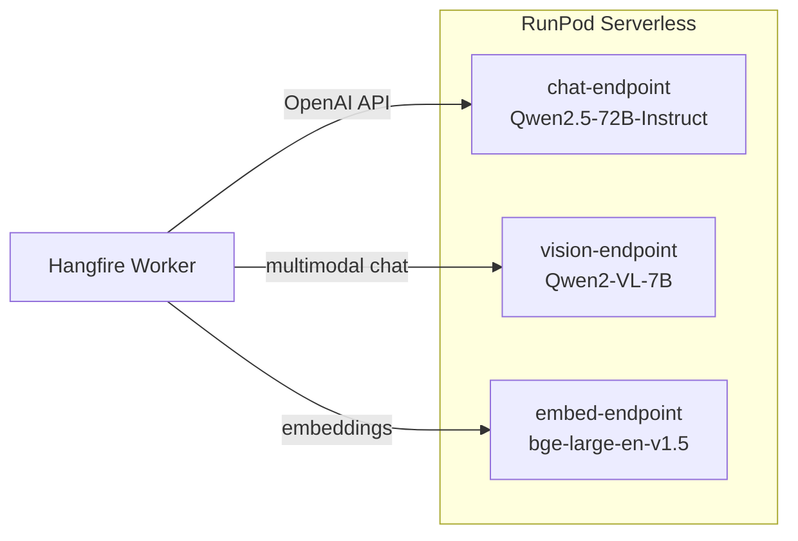

# ArchiMate AI Studio — LLM integration (RunPod)

**Parent:** [`overview.md`](overview.md)  
**Last updated:** 2026-09-11

---

## 1. Endpoint topology



Deploy each workload as a **separate serverless endpoint** for independent scaling and cost attribution.

---

## 2. Model selection rationale

| Role | Model | Why |
|------|-------|-----|
| **Primary text** | Qwen2.5-72B-Instruct | Strong JSON adherence; long context (128K); good on structured EA text |
| **Alt text** | Llama-3.1-70B-Instruct | Fallback; wide tooling support |
| **Fast pass** | Qwen2.5-14B-Instruct | Review summaries, digest naming |
| **Vision** | Qwen2-VL-7B-Instruct | Diagram + photo; cost-effective on RunPod |
| **Embeddings** | bge-large-en-v1.5 | 1024-dim; strong retrieval; CPU endpoint viable |

Final selection validated in Phase 0 spike against ArchiSurance patch generation benchmark.

---

## 3. Client interface

```csharp
public interface ILlmChatClient
{
    Task<LlmCompletion> CompleteAsync(LlmRequest request, CancellationToken ct);
}

public record LlmRequest(
    string SystemPrompt,
    IReadOnlyList<LlmMessage> Messages,
    int? MaxTokens,
    float Temperature = 0.2f,
    string? ResponseFormatJsonSchema = null);
```

Implementations:

- `RunPodOpenAiChatClient` — text
- `RunPodVisionChatClient` — image_url + text messages
- `RunPodEmbeddingClient` — batch embed

Factory reads `LlmProfile` from config: `chat`, `vision`, `embed`, `fast`.

---

## 4. Prompt templates

| Template ID | Based on | Mode |
|-------------|----------|------|
| `archimate-system-v1` | Archi-LLM `system-prompt.txt` | Patch / analysis / export |
| `fact-extract-v1` | New | CandidateFact JSON |
| `agent-merge-v1` | New | Motivation layer merge |
| `review-v1` | New | Findings JSON |
| `view-name-v1` | New | Plain text title + legend |

Store templates in `prompts/` directory; version in DB for A/B.

---

## 5. Context assembly order

1. System prompt (template)
2. `MODEL DIGEST` (plain text)
3. `RETRIEVED CONTEXT` (RAG, max 4K tokens)
4. `MODEL SLICE` (TOON or XML, budgeted)
5. `SELECTION CONTEXT` (if user selected view/element)
6. `USER REQUEST`

Token budget service:

- Estimate with `tiktoken`-compatible heuristic for Qwen/Llama vocab.
- If over budget: shrink slice → reduce RAG K → drop view coordinates → chunk map-reduce.

---

## 6. Response handling

| Response type | Parser |
|---------------|--------|
| CHANGES | `ModelPatchParser` (System.Text.Json) + alias validator |
| ANALYSIS | Markdown to UI |
| EXPORT | XML XSD validate before offering download |
| Facts | `CandidateFactParser` |

Retry on parse failure:

```
Re-prompt: "Your previous response was invalid JSON: {error}. Return only valid JSON matching schema."
```

Keep Archi-LLM regex parser logic only as **fallback** for malformed trailing content.

---

## 7. RunPod operational notes

| Topic | Guidance |
|-------|----------|
| **Cold start** | Set min workers = 1 for chat endpoint in prod |
| **Concurrency** | Limit parallel LLM jobs per tenant (default 2) |
| **Cost** | Log `promptTokens`, `completionTokens`, `endpointId` per job |
| **Privacy** | Feature flag `AllowCloudInference`; air-gap mode = no RunPod calls |
| **Health** | Cron `GET /health` on endpoint; circuit breaker opens after 3 failures |

---

## 8. Environment variables

```
RUNPOD_API_KEY=
RUNPOD_CHAT_ENDPOINT_ID=
RUNPOD_VISION_ENDPOINT_ID=
RUNPOD_EMBED_ENDPOINT_ID=
LLM_CHAT_MODEL=qwen2.5-72b-instruct
LLM_VISION_MODEL=qwen2-vl-7b-instruct
LLM_EMBED_MODEL=bge-large-en-v1.5
LLM_MAX_CONTEXT_TOKENS=32768
LLM_DEFAULT_TEMPERATURE=0.2
```
