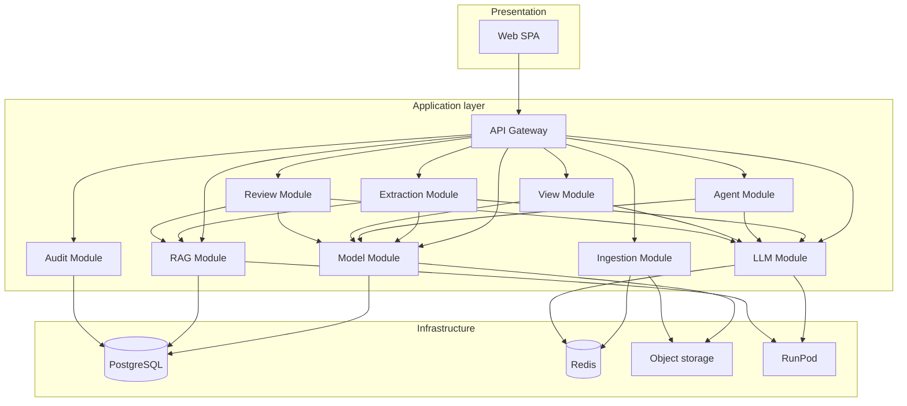

# ArchiMate AI Studio — modules and integrations

**Parent:** [`overview.md`](overview.md)  
**Last updated:** 2026-09-11

---

## 1. Module map

---

## 2. Bounded context details

### 2.1 Model Module

**Owns:** ArchiMate graph, serialization, validation, patch application.

| Inbound | Outbound |
|---------|----------|
| `ApplyPatchCommand` | `ModelUpdated` event |
| `ImportArchimateCommand` | `.archimate` blob |
| `ExportArchimateQuery` | Graph queries for View/RAG |

**Anti-patterns:**

- Do not expose raw XML strings to LLM module without chunk planner.
- Do not allow direct SQL updates to graph tables bypassing validation.

### 2.2 Ingestion Module

**Owns:** Upload handling, format detection, text/OCR extraction, job state.

| Integration | Style |
|-------------|-------|
| Object storage | Sync upload URL; async processing |
| Extraction Module | Async message `IngestionCompleted` |

**Job states:** `uploaded` → `extracting` → `extracted` → `mapping` → `completed` | `failed`

### 2.3 Extraction Module

**Owns:** Fact extraction, ArchiMate mapping, deduplication against existing graph.

| Dependency | Purpose |
|------------|---------|
| LLM Module | Structured prompts |
| RAG Module | Context retrieval |
| Model Module | Duplicate detection by (type, normalized name) |

**Output:** `ChangeProposal` (never writes model directly).

### 2.4 LLM Module

**Owns:** Prompt templates, RunPod clients, token budgeting, retry, response parsing.

| Client | RunPod endpoint |
|--------|-----------------|
| `IChatCompletionClient` | Text LLM |
| `IVisionCompletionClient` | Vision LLM |
| `IEmbeddingClient` | Embeddings |

Implements provider abstraction from Archi-LLM `EXTERNAL_LLM_PLAN.md`.

### 2.5 RAG Module

**Owns:** Chunking, embedding, hybrid search, re-index jobs.

**Triggers re-index:**

- Model patch applied
- Ingestion artifact linked to model
- Org standard document updated

### 2.6 Agent Module

**Owns:** Agent run lifecycle, brief generation, result validation, merge orchestration.

| Phase | Integration |
|-------|-------------|
| MVP | Manual JSON upload via API |
| Phase 2 | Webhook from CI / Cursor Cloud Agent |

Does **not** embed Cursor runtime — produces portable briefs consumable by humans or automation.

### 2.7 View Module

**Owns:** Viewpoint definitions, consolidation, layout, derived views.

Consumes graph from Model Module; may call LLM for naming and legend text only.

### 2.8 Review Module

**Owns:** Static rules engine + optional LLM critique.

| Check type | Engine |
|------------|--------|
| Metamodel matrix | Deterministic |
| Orphan / duplicate | Graph algorithms |
| Naming conventions | Regex + configurable rules |
| Completeness heuristics | LLM with RAG standards |

### 2.9 Audit Module

**Owns:** Immutable audit log: who approved what patch, source artifacts, agent run IDs.

---

## 3. Integration patterns

### 3.1 Sync vs async

| Operation | Pattern |
|-----------|---------|
| Export / search | Sync HTTP |
| Ingest / generate / review / consolidate | Async Hangfire job + polling or SSE |
| RAG re-index | Async; debounce 30s after burst edits |

### 3.2 Events (internal)

| Event | Publishers | Subscribers |
|-------|------------|-------------|
| `ModelUpdated` | Model | RAG (re-index), Audit |
| `IngestionCompleted` | Ingestion | Extraction |
| `ProposalApproved` | API | Model, Audit |
| `AgentRunCompleted` | Agent | Extraction |

Use in-process MediatR notifications at MVP; Redis pub/sub only if scaling workers horizontally.

### 3.3 External tool integration

| Tool | Direction | Contract |
|------|-----------|----------|
| **Archi** | Import/export | `.archimate` Open Exchange file |
| **Cursor agents** | Brief out / JSON in | `AgentBrief`, `AgentResult` schemas |
| **RunPod** | HTTPS OpenAI-compatible | Chat, vision, embeddings |
| **Enterprise standards** | Read-only | Markdown in `Architectures/standards/` synced to RAG |

### 3.4 Future: BPMN crosswalk

Not MVP. When added:

- Separate `BpmnDocument` context
- Crosswalk table: `archiElementId` ↔ `bpmnElementId`
- TOON prompt section for both (per Archi-LLM BPMN notes)

---

## 4. Anti-patterns (global)

1. **LLM writes XML directly** — always JSON patch → validator → serializer.
2. **Single monolithic prompt with full model** — use digest + RAG + chunking.
3. **Auto-apply agent output** — always `ChangeProposal`.
4. **Storing embeddings only in Redis** — pgvector is source of truth for retrieval.
5. **Mixing tenant data in RunPod logs** — scrub PII; tenant opt-in for cloud inference.

---

## 5. Test layer mapping

| Layer | Scope | Examples |
|-------|-------|----------|
| **Unit** | Validators, alias map, patch merge, chunker | Port Archi-LLM JUnit cases to xUnit |
| **Module** | Parser round-trip, XSD validation | ArchiSurance 3.2 fixture |
| **Integration** | RunPod mock, ingestion PDF fixture, RAG retrieval | Testcontainers PostgreSQL |
| **E2E** | Upload photo → approve proposal → export | Playwright + API |
