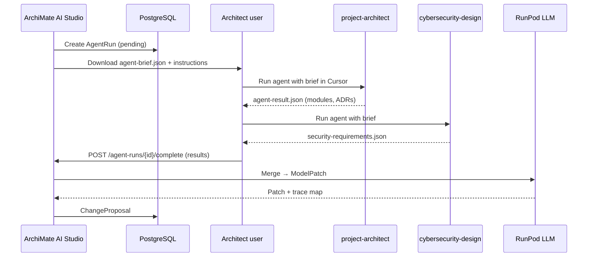

# ArchiMate AI Studio — multi-agent orchestration

**Parent:** [`overview.md`](overview.md)  
**Last updated:** 2026-09-11

---

## 1. Purpose

Encode outputs from **Cursor subagents** (and future automated agents) into the ArchiMate model as first-class **Motivation** and **Structure** elements — with traceability, not ad hoc prose in documentation fields.

---

## 2. Architecture



**Phase 2:** Replace manual upload with Cursor Cloud Agent webhook or CI pipeline posting results.

---

## 3. Agent brief package (`agent-brief.json`)

```json
{
  "runId": "uuid",
  "modelId": "uuid",
  "goal": "Add security requirements for payment flow",
  "scope": {
    "layers": ["Application", "Technology"],
    "elementIds": ["id-..."],
    "viewNames": ["Payment Cooperation"]
  },
  "modelDigest": "...",
  "modelSliceToon": "...",
  "technologyContext": "C# ASP.NET Core 9, PostgreSQL, RunPod, Clerk",
  "requestedAgents": ["cybersecurity-design", "project-architect"],
  "outputSchemaVersion": "1.0"
}
```

Generated by Agent Module from live model + linked `technology.md` stub per product.

---

## 4. Expected agent outputs

### 4.1 `project-architect` → `solution-architecture-result.json`

```json
{
  "modules": [
    {"name": "Payment Gateway Adapter", "type": "ApplicationComponent", "responsibilities": ["..."]}
  ],
  "integrations": [
    {"from": "Checkout API", "to": "Stripe", "pattern": "sync REST", "type": "ServingRelationship"}
  ],
  "adrs": [
    {"title": "Use idempotent webhooks", "status": "proposed", "context": "..."}
  ],
  "gaps": ["Missing Technology Service for Redis"]
}
```

### 4.2 `cybersecurity-design` → `security-requirements-result.json`

```json
{
  "maturityTier": "standard",
  "requirements": [
    {"id": "SEC-001", "text": "Encrypt PII at rest", "category": "data-protection", "priority": "high"}
  ],
  "constraints": [
    {"text": "No secrets in ArchiMate documentation fields", "category": "secrets"}
  ],
  "controlMappings": [
    {"requirementId": "SEC-001", "sabsaLayer": "Component", "relatedComponents": ["PostgreSQL"]}
  ]
}
```

---

## 5. Merge pipeline

| Step | Actor | Action |
|------|-------|--------|
| 1 | Validator | JSON Schema validate each agent result |
| 2 | Agent Module | Normalize names; detect conflicts |
| 3 | RunPod LLM | Map to ArchiMate elements (prompt `agent-merge-v1`) |
| 4 | Metamodel validator | Reject invalid types |
| 5 | ChangeProposal | Attach `provenance[]` per element |

**LLM merge prompt constraints:**

- Create `Requirement`, `Constraint`, `Principle`, `Goal` in Motivation folder.
- Link via `InfluenceRelationship` / `AssociationRelationship` to scoped ApplicationComponents.
- ADRs → `Requirement` with property `adrStatus`.
- Do not duplicate existing requirements (check RAG + name match).

---

## 6. Provenance model

Each AI-created element includes property:

| Property key | Value |
|--------------|-------|
| `ai:source` | `agent` \| `ingestion` \| `llm-extrapolate` |
| `ai:runId` | UUID |
| `ai:agentType` | `cybersecurity-design` |
| `ai:confidence` | 0.0–1.0 |
| `ai:sourceArtifactId` | optional |

---

## 7. Conflict resolution

| Conflict | Resolution |
|----------|--------------|
| Same requirement text, different agents | Single element; multiple provenance entries |
| Contradicting constraints | Flag `ReviewFinding`; do not auto-apply |
| New component name collision | Suffix `(agent-proposed)`; user resolves in UI |
| Agent suggests non-ArchiMate concept | Drop or map to nearest type with low confidence flag |

---

## 8. Security

- Agent briefs may contain sensitive architecture — tenant opt-in only.
- Redact secrets before brief export (scan for API key patterns).
- Store agent results encrypted at rest.
- Audit log: which user invoked which agent on which model scope.
