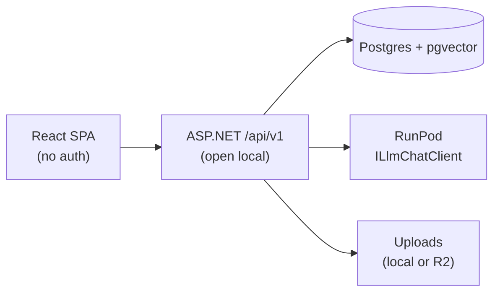

# ArchiMate AI Studio — MVP scope

**Status:** Locked (stakeholder)  
**Last updated:** 2026-09-22  
**ADR:** [`adr/ADR-0006-mvp-scope-and-auth-deferral.md`](adr/ADR-0006-mvp-scope-and-auth-deferral.md)

Implementers: read this before `/tdd` on Phase 0–2 work. Canonical product constraints for the first shippable demo.

---

## 1. Locked decisions

| Decision | Choice |
|----------|--------|
| **RAG** | **In MVP** — pgvector on PostgreSQL; ground NL generate + PDF map |
| **PDF ingest** | **In MVP** — PdfPig text layer only; PDF → LLM → `ModelPatch` → `ChangeProposal` |
| **UI** | **Required** — React SPA (Vite + TypeScript) |
| **Auth** | **Deferred** — no Clerk; local/dev open API |
| **LLM** | **RunPod real client** via `ILlmChatClient` (stub only for CI) |
| **Database** | **PostgreSQL required** (Neon-compatible); EF Core + pgvector |
| **Governance** | Human-in-the-loop `ChangeProposal` still required (ADR-0005) |
| **Canonical model** | `.archimate` XML; Archi-compatible IDs; ArchiSurance 3.2 for round-trip |

---

## 2. Success criteria

MVP is done when all of the following work end-to-end on a local (or Neon) Postgres + RunPod-configured API + React SPA:

1. **Import / export** — Load ArchiSurance 3.2 (or empty model); export valid `.archimate`; XSD + ID checks pass.
2. **NL generate / gap-fill** — User instruction → RunPod → validated `ModelPatch` → pending `ChangeProposal` → approve applies to canonical XML → re-index RAG.
3. **Sentence → element** — e.g. “Add ApplicationComponent Claims Portal” → proposal with Archi-compatible `id-` + hex ID → approve.
4. **PDF → proposals** — Upload PDF → PdfPig extract → chunk/embed (pgvector) → LLM map → `ChangeProposal`(s) for review.
5. **Browser UI** — SPA can: list/open models, trigger generate, upload PDF, list/approve/reject proposals, download export.
6. **No auth gate** — API usable without JWT for local/demo; do not block on Clerk.

---

## 3. In scope

| Area | MVP slice |
|------|-----------|
| **Model** | CRUD metadata, import/export `.archimate`, digest, patch applicator, metamodel/XSD validate |
| **LLM** | RunPod OpenAI-compatible chat client; digest + scoped context; `ModelPatch` parse/validate/repair |
| **Proposals** | Create / list / approve / reject; apply only on approve |
| **RAG** | Embed model elements + ingested PDF chunks; retrieve before generate/map |
| **Ingestion** | PDF (PdfPig text) + plain text/Markdown; Hangfire (or in-process) jobs |
| **API** | `/api/v1` models, generate, ingest, proposals, search/reindex (see [`api-design.md`](api-design.md)) |
| **UI** | React + Vite + TS: model shell, generate form, PDF upload, proposal review |
| **Data** | EF Core + Neon/Postgres + pgvector; object store optional (local disk OK for MVP uploads) |
| **CI** | Stub LLM; ArchiSurance round-trip; no live RunPod required in CI |

---

## 4. Out of scope (post-MVP)

- Vision / whiteboard OCR / diagram image ingest
- DOCX ingest
- Multi-agent enrich (`/cybersecurity-design`, `/project-architect` merge)
- View consolidation / React Flow sophistication beyond minimal proposal preview
- Clerk auth, multi-tenant orgs, RLS
- CRDT / real-time collab
- Auto-apply thresholds (keep approve/reject only)
- Production hardening beyond demo (rate limits, full observability) — nice-to-have, not blocking

---

## 5. Demo scripts

### Demo 1 — ArchiSurance NL gap-fill

1. Import ArchiSurance 3.2 fixture.
2. Open model digest in UI.
3. Instruction: complete or gap-fill a scoped Application-layer area (named folder or element set).
4. Inspect proposal (elements/relationships + validation).
5. Approve → export `.archimate` → open in Archi (optional) or re-import round-trip.

### Demo 2 — Sentence → ApplicationComponent

1. Open (or create) a model.
2. Instruction: “Add an ApplicationComponent named Claims Portal that serves the existing Claims business process” (adapt names to model).
3. Approve proposal; confirm element ID matches `id-` + 32 lowercase hex; relationship present if requested.

### Demo 3 — PDF → ArchiMate proposals

1. Upload a short architecture PDF (text layer, not scan-only).
2. Watch job progress; confirm chunks embedded.
3. Review resulting `ChangeProposal`(s); approve subset.
4. Search RAG for a term from the PDF; confirm retrieval hits document chunks.

---

## 6. Current code reality (baseline)

| Capability | State |
|------------|-------|
| Parse / serialize / XSD / Archi IDs / `ModelPatchParser` | **Done** |
| Model CRUD API | **Done** (`/api/v1/models`) |
| Patch applicator | **Done** |
| ChangeProposal flow | **Done** (create / approve / reject) |
| Generate + RunPod client | **Done** (RunPod when env set; stub in CI) |
| EF Core / Postgres | **Done** (optional; in-memory fallback) |
| React SPA | **Done** (`apps/web`) |
| PDF ingest | **Done** (PdfPig text layer) |
| RAG | **Done** (stub embeddings; search + retrieve into prompts) |
| Demo seed / ArchiSurance script | Open (backlog §7 F) |
| Auth | Deferred (ADR-0006) |

---

## 7. Ordered implementation backlog (`/tdd`)

Implement in order; each slice should be test-first.

### A–E — Shipped

Items 1–15 (patch applicator through PDF + RAG + SPA) are implemented on the MVP branch. Prefer regression tests over rework unless demos fail.

### F — Demo hardening (remaining)

16. Seed/script for ArchiSurance + sample PDF; README demo walkthrough with RunPod + `DATABASE_URL`.
17. Optional: RunPod embedding endpoint replacing `StubEmbeddingClient`; native pgvector distance ops.

---

## 8. Trust boundaries (MVP)

- Browser and API are **untrusted network peers** in production later; for MVP treat as single-user local/demo.
- RunPod receives prompts + retrieved snippets — never auto-write model without proposal approve.
- Canonical truth remains `.archimate` bytes (or equivalent XML blob) in store after approve.

---

## 9. Open risks

| Risk | Mitigation |
|------|------------|
| Scan-only PDFs yield empty PdfPig text | Document “text layer required”; vision explicitly out of MVP |
| RunPod cold start / flaky demo | Retry + clear job status in UI; keep stub path for offline |
| Patch hallucination (bad IDs/types) | Strict schema validate + metamodel check; reject invalid proposals |
| Open API abuse if exposed | Bind localhost / private demo URL; Clerk post-MVP (ADR-0006) |
| Scope creep (agents, views, DOCX) | Point to §4; do not start without new ADR |
| RAG empty on first generate | Index on import/approve; allow generate with digest-only fallback |

---

## 10. Related docs

| Doc | Use |
|-----|-----|
| [`overview.md`](overview.md) §12.2, §14 | Topology + phased delivery vs MVP |
| [`technology.md`](technology.md) | Stack; auth deferred |
| [`api-design.md`](api-design.md) | Endpoints; MVP auth = none |
| [`rag-architecture.md`](rag-architecture.md) | Chunk/index detail |
| [`ingestion-pipeline.md`](ingestion-pipeline.md) | PDF stages (text path only for MVP) |
| [`llm-runpod.md`](llm-runpod.md) | RunPod client contract |
| [`adr/ADR-0004-archimate-json-patch-contract.md`](adr/ADR-0004-archimate-json-patch-contract.md) | `ModelPatch` |
| [`adr/ADR-0005-human-in-the-loop-proposals.md`](adr/ADR-0005-human-in-the-loop-proposals.md) | Approvals |
| [`adr/ADR-0006-mvp-scope-and-auth-deferral.md`](adr/ADR-0006-mvp-scope-and-auth-deferral.md) | This scope decision |
