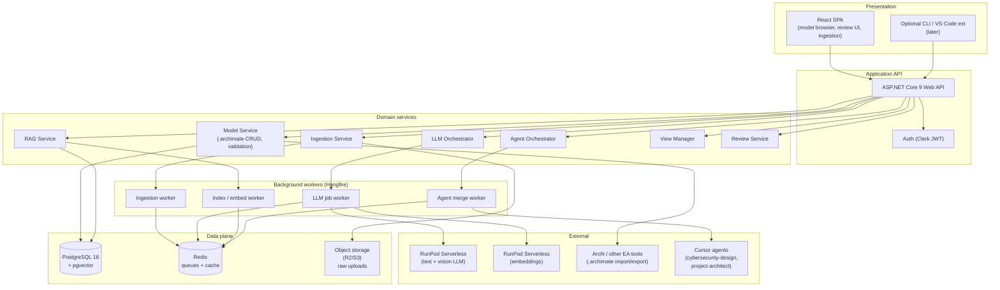
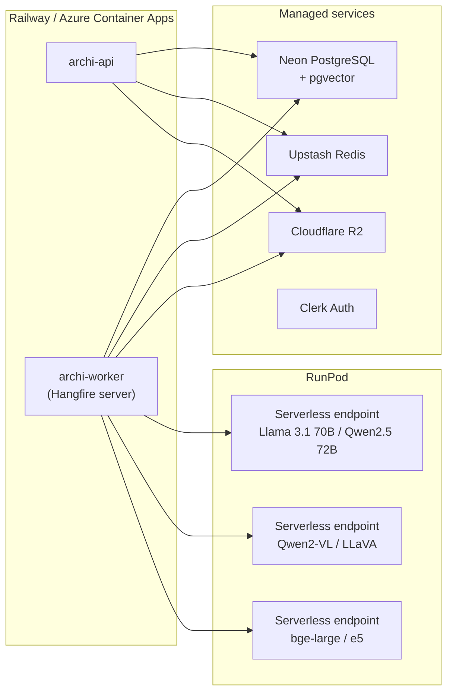
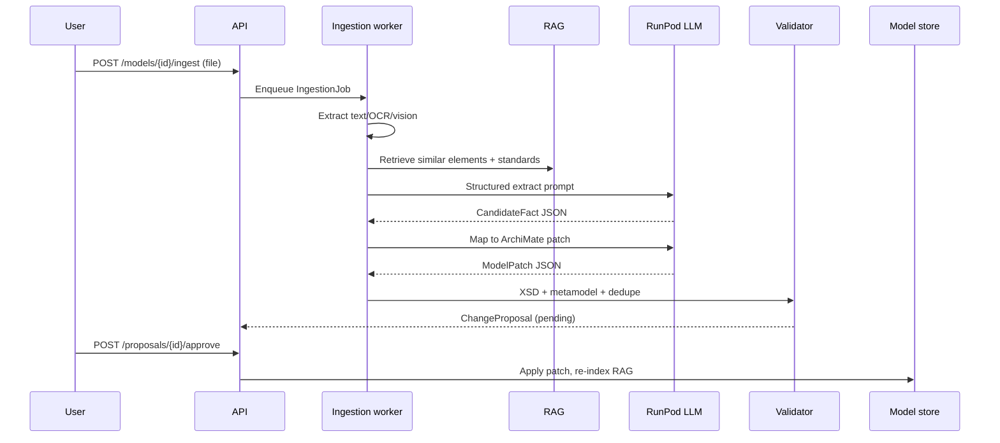
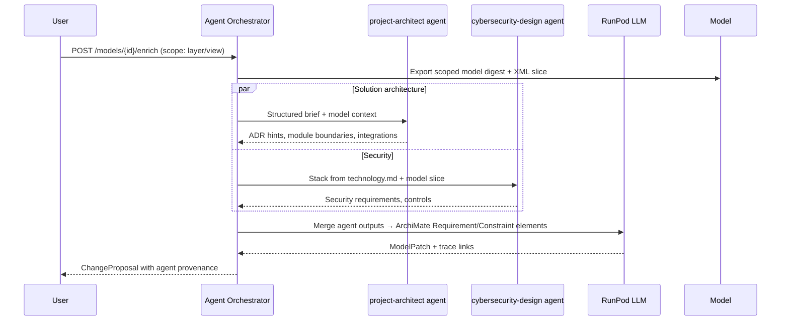
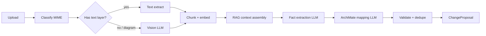
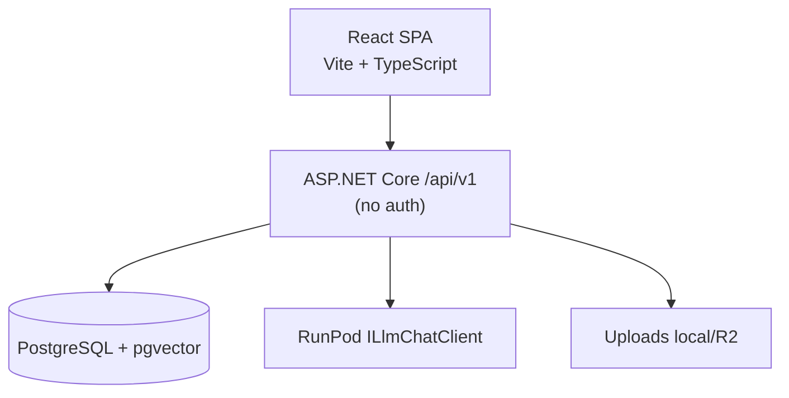

# ArchiMate AI Studio — architecture overview

**Product (working name):** **ArchiMate AI Studio** — an application for managing enterprise architecture and processes in **ArchiMate 3.2** notation, with AI-assisted ingestion, extrapolation, multi-agent enrichment, and model quality review.

**Status:** Phase 0 partial (parse/serialize/XSD/IDs/`ModelPatchParser`). MVP scope locked — see [`mvp.md`](mvp.md).  
**Implementation repo:** ArchiMate AI Studio (.NET monorepo + React SPA).  
**Last updated:** 2026-09-22

---

## Table of contents

1. [Purpose & scope](#1-purpose--scope)
2. [Principles](#2-principles)
3. [System architecture](#3-system-architecture)
4. [Data flows](#4-data-flows)
5. [ArchiMate file handling](#5-archimate-file-handling)
6. [Ingestion pipeline](#6-ingestion-pipeline)
7. [LLM integration (RunPod)](#7-llm-integration-runpod)
8. [RAG architecture](#8-rag-architecture)
9. [Multi-agent orchestration](#9-multi-agent-orchestration)
10. [View complexity management](#10-view-complexity-management)
11. [API design (summary)](#11-api-design-summary)
12. [Deployment architecture](#12-deployment-architecture)
13. [Lessons from Archi-LLM-plugin](#13-lessons-from-archi-llm-plugin)
14. [Phased delivery](#14-phased-delivery)
15. [Document map](#15-document-map)

---

## 1. Purpose & scope

### In scope (target product)

| Capability | Notes |
|------------|-------|
| **Native ArchiMate 3.2** | Read/write `.archimate` Open Exchange XML; metamodel validation; round-trip with Archi and other certified tools |
| **Multi-source ingestion** | Text, Markdown, PDF, Word, project requirements, system documentation |
| **Visual ingestion** | Photos of whiteboards, hand-drawn schemas, exported diagrams (OCR + vision LLM) |
| **Structured extraction** | Elements, relationships, properties, documentation from ingested content |
| **LLM extrapolation** | Infer missing elements/relationships with confidence scores and provenance |
| **Multi-agent enrichment** | Invoke `/cybersecurity-design` and `/project-architect` (and future agents) to derive requirements and encode them in the model |
| **RAG-grounded generation** | Retrieve model + org standards context before every LLM call |
| **Model review (secondary)** | Consistency, completeness, naming, relationship validity, viewpoint coverage |
| **View management** | Consolidate, simplify, and derive stakeholder views from a canonical model |
| **Audit & provenance** | Every AI-suggested change is traceable to source artifact + prompt + agent |

### Out of scope (initial architecture)

- BPMN 2.0 as a first-class interchange format (future crosswalk; see [`modules-and-integrations.md`](modules-and-integrations.md))
- Real-time collaborative editing (CRDT) — Phase 3+
- Training custom foundation models
- Replacing Archi desktop for power users (export/import compatibility is the goal)

---

## 2. Principles

1. **Exchange file is canonical** — PostgreSQL stores metadata, jobs, vectors, and audit; the `.archimate` XML (or normalized internal graph synced to it) is the modeling truth.
2. **Human-in-the-loop by default** — AI proposes; users approve, edit, or reject. Auto-apply only above configurable confidence thresholds per change type.
3. **Provenance over magic** — Every element/relationship carries optional `sourceRef` (ingestion job, document page, agent run).
4. **Validate before persist** — XSD + metamodel + relationship rules run on every write path (same discipline as Archi-LLM-plugin, but server-side).
5. **Token-aware context** — Digest + RAG + TOON/tabular projections for LLM prompts; never paste full multi-MB XML blindly.
6. **Agent boundaries** — Security and solution architecture agents produce **structured requirement artifacts** merged via orchestrator, not direct XML editing.
7. **C# backend end-to-end** — ASP.NET Core, Hangfire, EF Core; RunPod for GPU inference.

---

## 3. System architecture

### 3.1 Logical layers



### 3.2 Bounded contexts

| Context | Responsibility | Key artifacts |
|---------|----------------|---------------|
| **Model** | Parse, validate, merge, serialize `.archimate`; graph queries | `ArchimateDocument`, element/relationship graph |
| **Ingestion** | Upload, OCR, chunk, classify source type | `IngestionJob`, `SourceArtifact`, extracted `CandidateFact[]` |
| **Extraction** | Map facts → ArchiMate candidates (LLM + rules) | `ModelPatch` (JSON contract, Archi-LLM compatible) |
| **RAG** | Embed and retrieve model + org knowledge | Vector chunks keyed by `elementId`, `docId` |
| **Agent** | Invoke external agents; normalize outputs to requirements | `AgentRun`, `RequirementBundle` |
| **View** | Viewpoint filters, consolidation, layout hints | `ViewDefinition`, `ConsolidatedView` |
| **Review** | Static checks + LLM critique | `ReviewReport`, `Finding[]` |
| **Audit** | Change log, approvals | `ChangeProposal`, `ApprovalRecord` |

See [`modules-and-integrations.md`](modules-and-integrations.md) for integration contracts.

### 3.3 Component diagram (deployment unit view)



---

## 4. Data flows

### 4.1 Ingest document → model patch (primary flow)



### 4.2 Multi-agent enrichment flow



### 4.3 Review / refactor flow (secondary)

1. User triggers review on model or view.
2. **Static analyzer** runs: orphan elements, invalid relationships, duplicate names, missing realizations, motivation gaps.
3. **RAG** retrieves relevant standards (`standards/archimate-index.md`, org ADRs).
4. **LLM** produces ranked findings + optional `ModelPatch` for fixes.
5. User accepts subset via review UI.

---

## 5. ArchiMate file handling

### 5.1 Format baseline

| Aspect | Choice |
|--------|--------|
| **Canonical format** | Open Group **ArchiMate Model Exchange File** (XML), aligned to **3.2** |
| **Schemas** | `archimate3_Model.xsd`, `archimate3_Diagram.xsd`, `archimate3_View.xsd` |
| **Namespace** | `http://www.opengroup.org/xsd/archimate/3.0/` (+ diagram namespace) |
| **Archi compatibility** | Import/export tested against Archi 5.x; tolerate Archi-specific properties in `properties` bags |

### 5.2 Internal representation

```
ArchimateDocument
├── Metadata (name, documentation, organizations, propertyDefinitions)
├── ElementGraph (nodes: id, type, name, folder, properties, documentation)
├── RelationshipGraph (edges: type, source, target, properties)
├── Views[] (viewpoint, nodes, connections, layout)
└── SerializationState (checksum, schemaVersion, lastValidated)
```

**Implementation approach (C#):**

| Layer | Library / approach |
|-------|-------------------|
| **Parse / write XML** | `System.Xml.Linq` + generated partial classes OR **XmlSerializer** from XSD (build step: `xsd.exe` / `dotnet-xscgen`) |
| **XSD validation** | `System.Xml.Schema` on load and before save |
| **Metamodel validation** | In-process **ArchiMate 3.2 type registry** (port alias map from Archi-LLM-plugin `ArchiMateSchemaValidator`) |
| **Graph operations** | Domain layer with immutable patches; no direct LLM XML surgery |
| **ID policy** | `id-` + 32 hex (Archi convention); server generates IDs for all AI-created concepts |

### 5.3 Read/write pipeline

1. **Load** — Parse XML → validate XSD → build graph → index RAG (async).
2. **Patch apply** — Accept `ModelPatch` JSON (Archi-LLM-compatible schema) → validate types/relationships → merge → layout hints for new views.
3. **Save** — Graph → Open Exchange XML → XSD validate → persist blob (DB + optional R2) → emit `.archimate` download.

### 5.4 Validation rules (beyond XSD)

| Rule | Action |
|------|--------|
| Unknown element/relationship type | Reject patch; suggest alias normalization |
| Relationship source/target missing | Reject unless deferred resolution flag set |
| Duplicate (type, name) in same folder | Warn; block auto-apply |
| Invalid relationship per metamodel matrix | Reject (e.g., Composition between incompatible types) |
| Junction / Grouping misuse | Warn in review |
| View node references unknown element | Reject diagram portion of patch |

Detailed metamodel matrix: see [`docs-index.md`](docs-index.md) → Open Group XSD docs.

---

## 6. Ingestion pipeline

### 6.1 Supported sources

| Source | Extractor | Output |
|--------|-----------|--------|
| Plain text / Markdown | Direct | Sections + headings |
| PDF | **PdfPig** (text layer) + page raster fallback | Text per page + page images |
| DOCX | **OpenXml** | Structured paragraphs, tables |
| PNG/JPG/WebP | **Vision LLM** (primary) + **Tesseract** (fallback) | Diagram elements, labels, arrows |
| `.archimate` | Native parser | Full model import |
| CSV/JSON (inventory) | Template mapper | Bulk ApplicationComponent / Node rows |

### 6.2 Pipeline stages



### 6.3 Vision / diagram extraction strategy

1. **Pre-process** — Deskew, contrast normalize; split multi-diagram photos if detected.
2. **Vision prompt** — Return structured JSON: `shapes[]`, `connectors[]`, `labels[]`, `layerGuess`, `notationGuess` (ArchiMate vs ad hoc).
3. **Symbol classifier** — Map shape semantics to ArchiMate types (Business Process = rounded rect, etc.) with confidence.
4. **LLM mapping pass** — Combine vision JSON + OCR text + RAG (existing model elements) → `ModelPatch`.
5. **Human review UI** — Side-by-side: source image overlay + proposed graph.

### 6.4 Fact extraction schema (intermediate)

```json
{
  "facts": [
    {
      "kind": "system|process|integration|requirement|constraint|actor",
      "name": "Order API",
      "description": "...",
      "relatedNames": ["CRM", "Payment Gateway"],
      "relationshipHints": [{"type": "serving", "target": "Checkout Process"}],
      "source": {"artifactId": "...", "page": 2, "bbox": [0,0,100,100]},
      "confidence": 0.87
    }
  ]
}
```

See [`ingestion-pipeline.md`](ingestion-pipeline.md) for stage contracts and retry policy.

---

## 7. LLM integration (RunPod)

### 7.1 Endpoint strategy

| Workload | RunPod deployment | Model (initial) | Interface |
|----------|-------------------|-----------------|-----------|
| **Text reasoning / patch gen** | Serverless GPU endpoint | **Qwen2.5-72B-Instruct** or **Llama-3.1-70B-Instruct** | OpenAI-compatible `/v1/chat/completions` |
| **Vision / diagram OCR** | Serverless GPU endpoint | **Qwen2-VL-7B-Instruct** or **LLaVA-NeXT** | Multimodal chat (image + text) |
| **Embeddings (RAG)** | Serverless CPU/GPU | **BAAI/bge-large-en-v1.5** or **intfloat/e5-large-v2** | `/v1/embeddings` or custom handler |
| **Fast review pass** | Same or smaller endpoint | **Qwen2.5-14B-Instruct** | Chat completions |

**Client abstraction:** `ILlmClient` with implementations `RunPodOpenAiClient`, `RunPodVisionClient`, `RunPodEmbeddingClient` — mirrors the planned provider abstraction in Archi-LLM-plugin `EXTERNAL_LLM_PLAN.md`.

### 7.2 Prompt strategy

| Prompt type | System content | User content |
|-------------|----------------|--------------|
| **Patch generation** | Port Archi-LLM `system-prompt.txt` (3 response modes: ANALYSIS, EXPORT, CHANGES JSON) | TOON/tabular model slice + digest + RAG hits + user instruction |
| **Fact extraction** | JSON-only schema; no ArchiMate yet | Raw document chunks + optional image |
| **Agent merge** | Map Requirements, Constraints, Principles to motivation layer | Agent markdown outputs + model slice |
| **Review** | Checklist + standards excerpts | Model digest + findings template |

**Context budgeting (from Archi-LLM learnings):**

- `ModelContextDigest` — counts, folder breakdown, diagram names (always included).
- **TOON encoding** for element/relationship tables when slice > 8K tokens (see Archi-LLM `TOON_ARCHIMATE_BPMN.md`).
- **Chunking** — max 12 chunks; prefer cuts at `</view>` boundaries (`ModelXmlChunker` algorithm).
- **Multi-pass analysis** — map-reduce: per-chunk facts → merge → single patch.

### 7.3 Reliability

| Concern | Mitigation |
|---------|------------|
| Cold start (minutes) | Warm worker min replicas = 1 on RunPod; queue jobs with user-visible status |
| Timeouts | 120s read timeout; chunk smaller on retry |
| Invalid JSON | Regex/json repair pass; re-prompt with error; max 2 retries |
| Hallucinated IDs | Server assigns IDs; LLM uses temp refs resolved at apply time |
| Cost | Token budgets per org; cache embeddings; dedupe prompts via content hash |

See [`llm-runpod.md`](llm-runpod.md) for endpoint templates and environment variables.

---

## 8. RAG architecture

### 8.1 Vector store

| Component | Choice |
|-----------|--------|
| **Database** | PostgreSQL 16 + **pgvector** (same cluster as app data) |
| **Embedding dim** | 1024 (bge-large) or 768 (e5-base) — pick one at bootstrap |
| **Hybrid search** | pgvector cosine + **`tsvector`/`pg_trgm`** on names and documentation |

### 8.2 Chunk types

| Chunk kind | Source | Metadata |
|------------|--------|----------|
| `element` | Model graph | `elementId`, `type`, `layer`, `folder`, `modelId` |
| `relationship` | Model graph | `relationshipId`, `type`, `sourceId`, `targetId` |
| `view` | View XML | `viewId`, `viewpoint`, element refs |
| `document` | Ingested PDF/MD | `artifactId`, page, section heading |
| `standard` | Org architecture docs | `docPath`, framework (ArchiMate, TOGAF, SABSA) |
| `agent_output` | Agent runs | `agentType`, `runId` |

### 8.3 Chunking strategy for ArchiMate

**Elements** — one chunk per element:

```
[type] BusinessActor "Customer"
Folder: Business / Actors
Documentation: ...
Relationships out: (Assignment → Order Process), (Association → CRM Role)
```

**Relationships** — one chunk each (enables edge-centric retrieval):

```
ServingRelationship: Order API → Checkout Process
Source doc: ...
```

**Views** — chunk per view as element list + connection summary (not full coordinates unless layout question).

**Large models** — on re-index, batch embed 256 chunks/call; upsert on `modelVersion`.

### 8.4 Retrieval at inference time

1. Embed user query + ingestion section summary.
2. Retrieve top-K (K=20) across chunk kinds with filters: `modelId`, optional `layer`, `viewId`.
3. MMR re-rank for diversity (max 3 chunks per element).
4. Inject into prompt: **Retrieved context** block before model slice.
5. For patch generation, also pass **exact XML/TOON IDs** for referenced elements to reduce hallucination (Archi-LLM named-reference rule).

See [`rag-architecture.md`](rag-architecture.md) for SQL sketches and re-index triggers.

---

## 9. Multi-agent orchestration

### 9.1 Agent registry

| Agent | Invoked when | Input | Output artifact |
|-------|--------------|-------|-----------------|
| **`/project-architect`** | New module boundaries, stack decisions, integration patterns | Scoped model + `technology.md` stub | Module list, ADR candidates, integration edges |
| **`/cybersecurity-design`** | Security baseline, control mapping | Model technology slice + stack | `Requirement[]`, `Constraint[]`, control tags |
| **`/enterprise-architect`** (optional) | Viewpoint / plateau alignment | Full model digest | Viewpoint gaps, plateau suggestions |
| **`/architecture-compliance`** (optional) | Pre-release gate | Model + architecture docs | Compliance findings |

### 9.2 Invocation model

Agents run in **Cursor** (or CI webhook) — not inside the app process. The **Agent Orchestrator** service:

1. Builds a **brief package** (JSON + attachments): model slice XML/TOON, digest, user goal, output JSON schema.
2. Stores `AgentRun` as `pending`.
3. Triggers agent via:
   - **MVP:** Manual — user runs agent in Cursor, uploads result JSON to API.
   - **Phase 2:** Cursor Cloud Agent / webhook with repo scoped to `Architectures/<product>/`.
4. Validates agent JSON against schema.
5. **Merge LLM** maps artifacts → ArchiMate Motivation elements (`Requirement`, `Constraint`, `Principle`) with `properties` linking `agentRunId`, `sourceDoc`.
6. Creates `ChangeProposal`.

### 9.3 Merge rules

| Agent output | ArchiMate target |
|--------------|------------------|
| Functional requirement | `Requirement` + `Association` to related ApplicationComponent |
| Security control | `Requirement` or `Constraint` + tag property `sabsaLayer` |
| Module boundary | `ApplicationComponent` or `Grouping` + `Composition` children |
| Integration contract | `ApplicationInterface` + `ServingRelationship` |
| ADR decision | `Requirement` or custom property on `WorkPackage` |

Conflicts (two agents, same name) → orchestrator emits disambiguated names and `ReviewFinding`.

See [`multi-agent-orchestration.md`](multi-agent-orchestration.md).

---

## 10. View complexity management

### 10.1 Problem

Enterprise models accumulate overlapping views (50+ diagrams, duplicate elements, drill-down explosion). Stakeholders need **concise** views without losing traceability.

### 10.2 Approaches

| Technique | Description |
|-----------|-------------|
| **Viewpoint filtering** | Generate derived view from official ArchiMate viewpoint (layer/aspect filter) |
| **Depth-limited traversal** | BFS from anchor element to depth N (default 2) on serving/realization/flow edges |
| **Community detection** | Graph clustering (Louvain) on Application layer → one consolidated view per cluster |
| **Role-based simplification** | Hide Technology layer for business stakeholders; collapse Grouping |
| **Duplicate collapse** | Detect same (type, normalized name) across folders; suggest merge with alias map |
| **Layout synthesis** | Sugiyama-style layered layout for auto-generated views; preserve manual layout in source views |
| **View diff** | Plateau A vs B views for migration storytelling |

### 10.3 Consolidation algorithm (default)

```
Input: model graph G, anchor set A, maxNodes=25, relationshipTypes=R
1. Subgraph H = nodes within depth 2 of A following R
2. If |H| > maxNodes: rank nodes by betweenness centrality; keep top maxNodes
3. Apply viewpoint mask (e.g., Application Cooperation)
4. Split disconnected components into separate proposed views
5. Run layout engine → ViewDefinition
6. LLM names view + missing legend notes
Output: ConsolidatedView[] for user approval
```

### 10.4 Metrics (review integration)

- **View density** — edges/nodes ratio thresholds.
- **Cross-layer broken links** — Business Process without realizing Application Service.
- **Orphan rate** — elements not in any view.

See [`view-management.md`](view-management.md).

---

## 11. API design (summary)

Base path: `/api/v1`. **MVP auth:** none (open local/dev API). **Post-MVP:** Clerk JWT bearer.

| Method | Path | Purpose |
|--------|------|---------|
| `GET` | `/models` | List models (tenant-scoped) |
| `POST` | `/models` | Create empty model or import `.archimate` |
| `GET` | `/models/{id}` | Metadata + digest |
| `GET` | `/models/{id}/export` | Download `.archimate` |
| `PATCH` | `/models/{id}` | Rename, metadata |
| `POST` | `/models/{id}/ingest` | Upload artifact → `IngestionJob` |
| `GET` | `/ingestion-jobs/{id}` | Status + extracted facts |
| `POST` | `/models/{id}/generate` | LLM extrapolate missing data (scoped) |
| `POST` | `/models/{id}/enrich/agents` | Start agent enrichment run |
| `POST` | `/agent-runs/{id}/complete` | Upload agent result (MVP) |
| `GET` | `/proposals` | Pending change proposals |
| `POST` | `/proposals/{id}/approve` | Apply patch |
| `POST` | `/proposals/{id}/reject` | Discard |
| `POST` | `/models/{id}/review` | Run static + LLM review |
| `GET` | `/models/{id}/views` | List views |
| `POST` | `/models/{id}/views/consolidate` | View simplification job |
| `GET` | `/models/{id}/search` | Hybrid semantic + keyword search |
| `POST` | `/models/{id}/reindex` | Rebuild RAG index |

Full OpenAPI shapes: [`api-design.md`](api-design.md).

---

## 12. Deployment architecture

### 12.1 Environments

| Env | Purpose | RunPod | Data |
|-----|---------|--------|------|
| **dev** | Local Docker Compose + RunPod dev endpoints | Shared low-cost GPU | Local PG or Neon branch |
| **test** | CI + integration | Dedicated test endpoint | Neon branch |
| **prod** | Customer-facing | Production endpoints, min 1 worker | Neon main + R2 |

### 12.2 MVP topology (budget-conscious)

**Locked MVP:** React SPA + ASP.NET API + PostgreSQL/pgvector (Neon) + RunPod + PDF/RAG. **Auth deferred** (no Clerk). See [`mvp.md`](mvp.md) and [ADR-0006](adr/ADR-0006-mvp-scope-and-auth-deferral.md).

| Service | Host | MVP notes |
|---------|------|-----------|
| `archi-api` + Hangfire worker | **Railway** or local (single service) | Open API; no JWT |
| PostgreSQL + pgvector | **Neon** (or local Postgres) | Required for models, proposals, RAG |
| Redis | **Upstash** or local | Hangfire; optional if in-process jobs for local demo |
| Object storage | Local disk or **Cloudflare R2** | PDF uploads |
| Frontend | **React SPA** (Vite + TS) on **Vercel** / Pages / local | Required for MVP demos |
| LLM | **RunPod Serverless** | Real client; stub in CI only |
| Auth | **None (MVP)** → Clerk post-MVP | Do not block demos on Clerk |



### 12.3 Secrets

- `RUNPOD_API_KEY`, endpoint IDs per workload
- `DATABASE_URL`, optional `REDIS_URL`, `R2_*`
- `CLERK_*` — **post-MVP only**
- Never send raw `.archimate` to RunPod without tenant consent flag (relevant when multi-tenant ships)

See [`delivery/cicd-conventions.md`](delivery/cicd-conventions.md) and [`deployment.md`](deployment.md).

---

## 13. Lessons from Archi-LLM-plugin

Reviewed: [fideocam/Archi-LLM-plugin](https://github.com/fideocam/Archi-LLM-plugin) (ArchiGPT, Java/Eclipse, Ollama).

### 13.1 Reuse

| Pattern | Location in plugin | Adoption |
|---------|-------------------|----------|
| **Three response modes** | `system-prompt.txt` — ANALYSIS / EXPORT / CHANGES JSON | Port verbatim to server prompts; same `ModelPatch` contract |
| **JSON patch schema** | `ArchiMateLLMResult`, `ArchiMateLLMResultParser` | Reimplement in C#; identical wire format for compatibility |
| **Metamodel alias map** | `ArchiMateSchemaValidator` | Port alias dictionary (Actor→BusinessActor, etc.) |
| **Model digest** | `ModelContextDigest` | Plain-text summary always prepended |
| **XML chunking at `</view>`** | `ModelXmlChunker` | Same algorithm; configurable max chunks |
| **Context budget** | `LlmContextBudget`, `ModelContextChunkPlanner` | Token estimation before call |
| **Selection context** | `SelectionContextBuilder` | Web UI selection → same context block |
| **TOON for token savings** | `docs/TOON_ARCHIMATE_BPMN.md` | Use for prompts only; persist XML |
| **Provider abstraction plan** | `docs/EXTERNAL_LLM_PLAN.md` | `ILlmClient` → RunPod OpenAI-compatible |
| **Skills / agent docs** | `docs/Skills.md` | Load Cursor skills for ArchiMate patch + review tasks |

### 13.2 Improve

| Gap in plugin | Our approach |
|---------------|--------------|
| Ollama-only; local desktop | RunPod serverless; multi-user web app |
| No RAG | pgvector over model + docs + standards |
| No ingestion pipeline | Full PDF/image/text pipeline |
| No provenance / approval | ChangeProposal workflow + audit log |
| Regex JSON parser (fragile) | `System.Text.Json` + schema validation + repair retry |
| EMF/Archi-coupled validation | Standalone metamodel registry + XSD |
| No multi-agent | Agent Orchestrator with structured merge |
| No view consolidation | View Manager module |
| Truncated XML without persistent index | RAG + chunk planner + map-reduce |
| API keys in Eclipse prefs | Clerk + tenant isolation + encryption at rest |

### 13.3 Do not copy

- Eclipse plugin lifecycle and Archi EMF object graph coupling — use exchange XML + internal graph instead.
- Synchronous UI-thread LLM calls — always async job queue.
- Regex-only JSON extraction as sole parser — keep as last-resort fallback only.

See [`archi-llm-plugin-learnings.md`](archi-llm-plugin-learnings.md) for file-level mapping.

---

## 14. Phased delivery

**MVP (locked)** = **Phase 0 complete** + **Phase 1** + **Phase 2 PDF/RAG subset** (PdfPig text; no vision/DOCX). Auth, agents, and view consolidation are **out of MVP**. Detail: [`mvp.md`](mvp.md).

| Phase | Deliverable | vs MVP |
|-------|-------------|--------|
| **0 — Foundation** | Model CRUD, XSD validation, import/export, patch applicator, React SPA shell | **Required** (auth removed from Phase 0) |
| **1 — LLM patch loop** | Real RunPod client, digest + RAG context, `ChangeProposal` API + UI | **Required** |
| **2 — Ingestion & RAG** | PDF/text + pgvector index + fact→patch; vision/DOCX later | **MVP = PDF text + RAG only** |
| **3 — Agents & review** | Agent orchestrator, static review, view consolidation | **Post-MVP** |
| **4 — Polish** | Auth (Clerk), multi-tenant, performance, org standards library | **Post-MVP** |

---

## 15. Document map

| Document | Contents |
|----------|----------|
| [`mvp.md`](mvp.md) | **Locked MVP** — scope, demos, `/tdd` backlog, risks |
| [`modules-and-integrations.md`](modules-and-integrations.md) | Bounded contexts, events, anti-patterns |
| [`technology.md`](technology.md) | Stack versions, libraries |
| [`ingestion-pipeline.md`](ingestion-pipeline.md) | Stage contracts, OCR/vision |
| [`llm-runpod.md`](llm-runpod.md) | Endpoints, prompts, env vars |
| [`rag-architecture.md`](rag-architecture.md) | Chunking, SQL, re-index |
| [`multi-agent-orchestration.md`](multi-agent-orchestration.md) | Agent briefs, merge schemas |
| [`view-management.md`](view-management.md) | Consolidation algorithms |
| [`api-design.md`](api-design.md) | OpenAPI-level detail |
| [`deployment.md`](deployment.md) | Infra diagrams, scaling |
| [`archi-llm-plugin-learnings.md`](archi-llm-plugin-learnings.md) | Detailed plugin review |
| [`docs-index.md`](docs-index.md) | External references |
| [`dependencies/repo-map.md`](dependencies/repo-map.md) | Cross-repo map |
| [`adr/`](adr/) | Decision records (incl. ADR-0006 MVP) |
| [`delivery/cicd-conventions.md`](delivery/cicd-conventions.md) | Branching, CI |

**Implementers start here:** [`mvp.md`](mvp.md) → this file → `technology.md` → `modules-and-integrations.md` → deep dive for your sprint.
