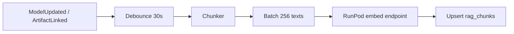

# ArchiMate AI Studio — RAG architecture

**Parent:** [`overview.md`](overview.md)  
**Last updated:** 2026-09-11

---

## 1. Overview

RAG grounds every LLM call in:

1. **Current model state** (elements, relationships, views)
2. **Ingested source documents** linked to the model
3. **Organizational standards** (ArchiMate index, ADRs, security requirements)

**Store:** PostgreSQL 16 + pgvector + full-text search.

---

## 2. Schema (conceptual)

```sql
CREATE TABLE rag_chunks (
  id UUID PRIMARY KEY,
  tenant_id UUID NOT NULL,
  model_id UUID,                    -- null for org-wide standards
  chunk_kind TEXT NOT NULL,         -- element, relationship, view, document, standard, agent_output
  source_id TEXT NOT NULL,          -- elementId, artifactId, doc path
  content TEXT NOT NULL,
  embedding vector(1024),
  metadata JSONB NOT NULL,
  content_tsv tsvector GENERATED ALWAYS AS (to_tsvector('english', content)) STORED,
  created_at TIMESTAMPTZ DEFAULT now()
);

CREATE INDEX ON rag_chunks USING ivfflat (embedding vector_cosine_ops) WITH (lists = 100);
CREATE INDEX ON rag_chunks USING gin (content_tsv);
CREATE INDEX ON rag_chunks (tenant_id, model_id, chunk_kind);
```

---

## 3. Chunking rules

### 3.1 ArchiMate elements

Template:

```
ArchiMateElement
Type: {BusinessActor}
Name: "{Customer}"
Id: {id-...}
Folder: {Business / Actors}
Documentation: {first 500 chars}
Properties: {key=value,...}
Outgoing: [{Assignment} → Order Process, ...]
Incoming: [{Association} ← CRM System, ...]
```

One chunk per element; update on patch apply (upsert by `source_id`).

### 3.2 Relationships

```
ArchiMateRelationship
Type: {ServingRelationship}
Name: "{optional}"
Id: {id-...}
Source: {ApplicationService} "{Order API}"
Target: {BusinessProcess} "{Checkout}"
```

### 3.3 Views

```
ArchiMateView
Name: "{Application Cooperation}"
Viewpoint: {application_cooperation}
Elements: [list of names/types on view]
Connections: [source → target (relationship type)]
```

Omit x/y/width/height unless layout task.

### 3.4 Document chunks

- 512-token windows, 64 overlap
- Metadata: `{ artifactId, page, section, ingestionJobId }`

### 3.5 Standards

Sync from `Architectures/standards/*.md` and product `docs/architecture/` into `chunk_kind=standard` on deploy or webhook.

---

## 4. Embedding pipeline



Use **content hash** to skip re-embed when text unchanged.

---

## 5. Retrieval query

```csharp
public async Task<IReadOnlyList<RagHit>> RetrieveAsync(RagQuery q)
{
    // 1. Embed query
    // 2. Vector search: top 40 by cosine
    // 3. Keyword search: ts_rank on content_tsv, top 20
    // 4. Reciprocal rank fusion
    // 5. MMR diversity (lambda=0.7), max 3 per source_id
    // 6. Return top K=20
}
```

Filters: `tenant_id`, `model_id`, optional `chunk_kind IN (...)`, optional layer filter via metadata.

---

## 6. Use cases

| Use case | Retrieval focus |
|----------|-----------------|
| Ingestion mapping | document + element chunks |
| Patch generation | element + relationship + view |
| Agent merge | standard + motivation elements |
| Review | standard + full model element types |
| Search UI | hybrid, no LLM |

---

## 7. Evaluation (Phase 2)

- Golden set: 50 questions against ArchiSurance model
- Metrics: recall@10, patch accuracy (valid types/relationships)
- Regression in CI with mocked embeddings
